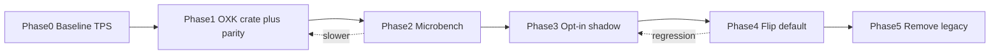

---
todos:
  - id: baseline-silver
    content: "Phase 0: Record Silver baseline — lscpu, oxidize-bench decode tok/s, llama.cpp reference, thread sweep (store numbers in scripts/ or bench output)"
    status: pending
  - id: oxk-crate-scaffold
    content: "Phase 1: Add oxidize-kernels crate (optional dep); scalar + AVX2 C; zero wiring to inference — default build unchanged"
    status: pending
  - id: oxk-parity-tests
    content: "Phase 1b: Parity tests — oxk vs legacy scalar/AVX2 on Q4_K fixtures; must pass before any runtime switch"
    status: pending
  - id: oxk-microbench
    content: "Phase 2a: oxidize-kernels/benches or extend gemv_bench — compare legacy vs OXK row_dot_x4 and full GEMV on Silver dimensions"
    status: pending
  - id: oxk-gemv-shadow
    content: "Phase 2b: Shadow mode — OXK runs alongside legacy in tests only (dual compute + assert close); still not default"
    status: pending
  - id: oxk-gemv-optin
    content: "Phase 3: Opt-in runtime — cargo feature oxk + OXIDIZE_GEMV=oxk|legacy|shadow; default legacy until bench gate passes"
    status: pending
  - id: oxk-moe-ffn
    content: "Phase 4: OXK MoE fused gate+up + FFN GEMV (next biggest TPS slice after QKV)"
    status: pending
  - id: oxk-make-default
    content: "Phase 5: Flip default to OXK only after Silver e2e ≥ legacy; keep legacy behind flag one release"
    status: pending
  - id: remove-avx512
    content: "Phase 6: Delete AVX-512/VNNI intrinsics only after OXK default + CI green for 1 week"
    status: pending
  - id: oxk-act-attn
    content: "Phase 7 (optional TPS): SwiGLU, RMS, flash-attn dots — only if profiling shows >5% decode time"
    status: pending
isProject: false
---

# Custom Oxidize Kernels (OXK) — Speed-First, Zero-Break Migration

## Core rule: build → test → switch → remove

Nothing is deleted until OXK is **faster or equal** on Silver for that specific kernel. Legacy code stays the **default** until each gate passes.



Every phase must keep `make test` / `make ci` green. Default user path = legacy until Phase 5.

---

## Speed-first: what to build, in order

Decode TPS on Q4_K models is dominated by **quantized GEMV** (~70–85% of CPU time). Implement OXK in this order — each step targets the largest remaining slice:

| Priority | Kernel | Est. decode impact | OXK file | Gate to flip default |
|----------|--------|-------------------|----------|----------------------|
| **1** | `q4k_row_dot` + **×4/×8 multi-row** | Foundation for all below | `oxk_q4k.c` | Microbench ≥ legacy VNNI *and* AVX2 x4 on Silver |
| **2** | `gemv_q4k` (single token, all layers) | **~35–45%** total TPS | `oxk_q4k.c` | Shadow + e2e decode ≥ baseline |
| **3** | `gemm_q4k` (batched QKV prefill) | Prefill latency, minor decode | `oxk_q4k.c` | Same parity; decode TPS secondary |
| **4** | MoE **fused gate+up** | **~15–25%** on MoE models | `oxk_moe.c` | MoE model bench only |
| **5** | FFN down-proj + attn out-proj GEMV | **~10–20%** | reuses `oxk_q4k.c` | Covered by #2 if same path |
| **6** | Q6_K / Q8_0 GEMV | Model-dependent | `oxk_q6k.c`, `oxk_q8_0.c` | Only if your GGUFs use these quants |
| **7** | SwiGLU, RMS norm | **~3–8%** | `oxk_act.c` | Profile first; skip if &lt;5% |
| **8** | Flash-attn f32 dot | Long-context only | `oxk_dot.c` | Only if ctx &gt; 4k |

**Custom speed bets (why OXK can win without AVX-512):**

- **Always-on multi-row (×4 then ×8)** — legacy disables x4 when VNNI is present; OXK never does that.
- **Software prefetch** (`_mm_prefetch` on next Q4_K block + Q8 row) — tune for Silver L2/L3.
- **256-bit AVX2 at full turbo** — avoid AVX-512 frequency drop on sustained decode.
- **Input Q8_K quantized once per token** — reuse across all row dots in a layer (already in legacy; keep in OXK).
- **Thread count** — physical cores, not HT (`OXIDIZE_THREADS` in [`oxidize-ffi`](oxidize-ffi/src/lib.rs)); bench 4/8/12/16 on Silver.

---

## Zero-break architecture

### Optional dependency (default build unchanged)

```toml
# oxidize-core/Cargo.toml
[features]
default = []
oxk = ["dep:oxidize-kernels"]

[dependencies]
oxidize-kernels = { path = "../oxidize-kernels", optional = true }
```

Without `--features oxk`, `oxidize-core` builds exactly as today. CI runs **both** matrices: default and `oxk`.

### Runtime dispatch (three modes)

Add env var (matches existing `OXIDIZE_*` pattern in [`inference.rs`](oxidize-core/src/model/inference.rs)):

| `OXIDIZE_GEMV` | Behavior |
|----------------|----------|
| `legacy` (default) | Current `tensor.rs` intrinsics — **unchanged** |
| `oxk` | OXK C kernels only |
| `shadow` | Run **both**, assert `max_rel_err < 1e-4`, record timing to stderr (dev/bench only) |

Implementation sketch in `tensor.rs` — **one choke point**, no scattered changes:

```rust
fn gemv_q4k_dispatch(...) -> Result<(), GemvError> {
    match std::env::var("OXIDIZE_GEMV").as_deref() {
        Ok("oxk") if cfg!(feature = "oxk") => oxk::gemv_q4k(...),
        Ok("shadow") if cfg!(feature = "oxk") => shadow_gemv_q4k(...),
        _ => gemv_q4k_legacy(...),  // existing code, untouched
    }
}
```

CUDA/Metal/WebGPU paths are **never** touched by OXK.

### `oxidize-kernels` crate layout

```
oxidize-kernels/
├── Cargo.toml
├── build.rs
├── benches/oxk_q4k_bench.rs    # criterion: row_dot, gemv vs legacy FFI callbacks
├── c/oxk_dispatch.c            # CPUID → fn pointers (scalar, avx2)
├── c/oxk_q4k.c                 # priority 1–3
├── c/oxk_moe.c                 # priority 4
├── c/oxk_act.c, oxk_dot.c      # priority 7–8
└── src/lib.rs                  # Rust API + parity test helpers
```

---

## Testing gates (must pass before next phase)

### Gate A — Correctness (every PR touching OXK)

- Unit tests: OXK scalar vs legacy scalar — **exact** or documented tolerance for Q4_K integer math.
- OXK AVX2 vs OXK scalar — **exact** match.
- Property tests on random small matrices (rows/cols multiples of 32).
- `OXIDIZE_GEMV=shadow` in `make test` when built with `--features oxk`.

### Gate B — Microbench (before opt-in default)

On Xeon Silver, for realistic shapes (e.g. hidden 4096, 8192, rows = hidden or intermediate):

```bash
# New bench (add in Phase 2)
sfw cargo bench -p oxidize-kernels --features avx2 -- q4k_row_dot

# Existing (extend for Q4_K)
sfw cargo bench -p oxidize-core -- gemv
```

**Pass criteria:** OXK `row_dot_x4` ≥ **105%** of legacy VNNI throughput *or* ≥ **110%** of legacy AVX2 x4 on **sustained** runs (≥30s, not 3s warmup).

### Gate C — End-to-end TPS (before flip default)

```bash
sfw cargo run --release -p oxidize-cli --features oxk --bin bench -- \
  --model model.Q4_K_M.gguf --mode decode --iterations 20

# Compare:
OXIDIZE_GEMV=legacy  → baseline tok/s
OXIDIZE_GEMV=oxk     → must be ≥ baseline (same threads, mlock on)
```

**Pass criteria:** OXK e2e ≥ **100%** baseline; stretch ≥ **110%**. Compare llama.cpp same model as north star.

### Gate D — Removal (Phase 6 only)

Per kernel family:

1. OXK is **default** (`OXIDIZE_GEMV` unset → oxk).
2. Legacy kept behind `OXIDIZE_GEMV=legacy` for one release cycle.
3. CI green on default + oxk features.
4. Then delete `q4_k_q8_k_row_dot_vnni` and related AVX-512 blocks for **that family only**.

---

## Phase-by-phase (speed-focused, nothing breaks)

### Phase 0 — Baseline (1 day)

On Silver (`lscpu`; SSH keys only):

- Record: model, quant, hidden, layers, threads, tok/s (legacy).
- Run llama.cpp same config.
- Save thread sweep (physical, physical+HT, OXIDIZE_THREADS).

**Output:** a number you cannot regress below.

### Phase 1 — OXK crate, no inference wiring (2–3 days)

- Add `oxidize-kernels` to workspace; **optional** dep only.
- Implement `oxk_q4k_row_dot` scalar + AVX2 in C.
- Parity tests only — **zero changes** to `gemv_quantized_f32` behavior.

### Phase 2 — Microbench + shadow (3–5 days)

- `oxk_gemv_q4k` full implementation (multi-row, Q8 input once).
- Criterion benches vs legacy (call legacy via test-only Rust wrappers).
- Wire `OXIDIZE_GEMV=shadow` at dispatch choke point — **default still legacy**.
- Iterate C until Gate B passes on Silver.

### Phase 3 — Opt-in OXK (1 day)

- `OXIDIZE_GEMV=oxk` for manual/bench use.
- Document in CLI `--help` or env docs.
- **Still not default.**

### Phase 4 — MoE + FFN (if MoE model matters)

- `oxk_moe.c` fused gate+up.
- Re-run Gate C on MoE GGUF.

### Phase 5 — Flip default (1 day)

- Unset env → OXK on x86 with `oxk` feature enabled in release builds.
- `OXIDIZE_GEMV=legacy` escape hatch remains.
- Monitor Silver for 1 week.

### Phase 6 — Remove AVX-512 / shrink tensor.rs

- Delete VNNI + AVX-512 `target_feature` blocks **only** for migrated ops.
- Legacy path becomes thin wrapper → OXK or scalar fallback.
- Scalar + NEON stay forever.

### Phase 7 — Activations / attn (optional)

- Only if `perf record` on Silver shows &gt;5% in SwiGLU/RMS/attn dot.

---

## PR strategy (parallel safe)

| PR | Adds | Removes | Breaks? |
|----|------|---------|---------|
| PR1 | `oxidize-kernels` crate, scalar C | nothing | No |
| PR2 | AVX2 `oxk_q4k`, parity tests | nothing | No |
| PR3 | `oxk` feature + dispatch choke + shadow mode | nothing | No (default legacy) |
| PR4 | `oxk_gemv_q4k`, benches | nothing | No |
| PR5 | MoE OXK | nothing | No |
| PR6 | Default → OXK | nothing | Only if Gate C passed |
| PR7 | Delete AVX-512 blocks | VNNI code | Only after PR6 stable |

Each PR: `make test` + `make test` with `--features oxk`.

---

## What stays untouched until Phase 6

- All `q4_k_q8_k_row_dot_vnni` and AVX-512 flash-attn dots
- Default `gemv_quantized_f32` code paths
- CUDA / Metal / Vulkan / WebGPU
- Go / Python ports (sync after Rust OXK is default)

---

## Success criteria (speed)

| Metric | Target |
|--------|--------|
| Microbench `q4k_row_dot_x4` vs legacy VNNI | ≥ **1.05×** sustained on Silver |
| E2E decode tok/s vs pre-OXK baseline | ≥ **1.00×** (stretch **1.10×**) |
| E2E vs llama.cpp (same Q4_K GGUF) | ≥ **0.85×** initially, **0.95×** stretch |
| CI | Default + `oxk` feature both green |
| Breakage | Zero user-visible regression while `OXIDIZE_GEMV=legacy` (default through Phase 5) |

---

## First coding slice (maximum speed learning per hour)

Build **`oxk_q4k_row_dot_x4`** in C only:

1. No inference wiring.
2. Bench vs `q4_k_q8_k_row_dot_vnni` and `q4_k_q8_k_row_dot_x4_avx2` on Silver with hidden=4096.
3. If ≥1.05× sustained → proceed to full `gemv_q4k`.
4. If not → tune prefetch + row count (try ×8) before any deletion.

This is the cheapest proof that the custom-no-AVX-512 strategy wins on your hardware.
