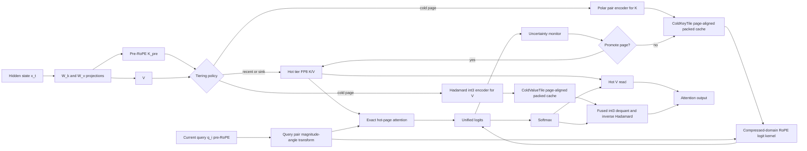

# RotorQuant and KV Cache Compression for Transformer LLMs

## Executive summary

KV cache optimization is now a first-order systems problem for long-context and long-generation LLM inference. In autoregressive decoding, each newly generated query must read prior keys and values across layers and heads, so decode often becomes memory-bandwidth bound rather than FLOP bound. Official docs and papers from Hugging Face, TensorRT-LLM, KIVI, and vLLM all point in the same direction: the cache grows linearly with sequence length, it is read repeatedly during decoding, and it quickly becomes the dominant bottleneck for throughput, batch size, and feasible context length. citeturn19view0turn19view3turn7search3turn19view6

RotorQuant is best understood as a lightweight engineering reinterpretation of TurboQuant. TurboQuant uses a full random rotation followed by scalar Lloyd-Max quantization plus a 1-bit QJL residual correction. RotorQuant replaces the expensive dense rotation with many tiny Clifford-rotor blocks, preserving the same basic "decorrelate -> quantize -> residual-correct" logic while slashing rotation cost and parameter count. The upside is obvious: much cheaper decorrelation at decode time. The downside is also obvious: the current public evidence is much narrower than the evidence for peer-reviewed methods like KIVI, KVQuant, RotateKV, CommVQ, and RAP. RotorQuant is currently a short March 2026 note plus a GitHub repo, not a mature benchmark suite. That does not make it nonsense, but it does mean you should treat its headline numbers as promising, not settled. citeturn32view0turn32view2turn32view3turn23view0

The literature has converged on a few hard truths. First, RoPE is not a minor detail. It changes which compression schemes work because it mixes pairs of channels in a way that breaks naive post-RoPE quantization and low-rank absorption. KVQuant, RotateKV, CommVQ, and RAP all explicitly work around RoPE rather than pretending it is irrelevant. Second, keys and values are not symmetric. KIVI and KVarN both allocate bits asymmetrically because keys are more sensitive to positional geometry and value errors accumulate differently in long reasoning traces. Third, methods that look great in paper-land can run straight into serving infrastructure walls if they need historical attention scores that FlashAttention never materializes, or if they evict tokens in a paged allocator without actually freeing whole blocks. citeturn17view4turn17view2turn34view0turn35view0turn22view4turn37view0

If you want the shortest honest ranking of the current landscape, it is this. For stable, relatively reproducible low-bit quantization, KIVI and KVQuant remain strong baselines. For more aggressive RoPE-aware 2-bit quantization, RotateKV and KVarN are among the most convincing recent directions. For learned vector-quantized caches, CommVQ is one of the most interesting RoPE-aware proposals, especially at 1-bit to 2-bit regimes. For pruning and token selection, H2O, Scissorhands, SnapKV, ChunkKV, and related methods can deliver dramatic memory savings, but systems integration is much messier than many papers admit. For hidden-dimension compression, Palu, Eigen Attention, LoRC, and RAP are serious alternatives when you are willing to modify the attention path more deeply. citeturn23view3turn30view0turn23view2turn9search8turn34view0turn17view6turn17view7turn17view8turn36search2turn22view5turn35view1turn24search3turn35view0

The novel method proposed in this report is **HelixCache**, a RoPE-native cache format that stores keys in pre-RoPE polar coordinates at the 2D RoPE-pair level, computes logits directly in compressed form without reconstructing Cartesian keys, quantizes values separately with blockwise low-bit transforms, and adds an uncertainty-triggered promotion mechanism that selectively upgrades hard tiles to a higher precision tier. It is plausible because it is built from facts the literature already established: pre-RoPE handling matters, key/value asymmetry matters, compressed-domain attention matters, and production viability depends on regular memory access and packed block formats. It is novel because it uses the natural geometry of RoPE pairs directly, instead of approximating them after the fact with generic scalar channels, dense rotations, or codebooks trained to commute with RoPE. In expectation, HelixCache should trade a bit of ultra-low-bit peak compression for much better hardware regularity and stronger robustness on retrieval-heavy and reasoning-heavy workloads than plain scalar quantization. That is the right trade if your goal is production decode speed, not just a pretty compression number in isolation. citeturn17view4turn17view2turn34view0turn37view0

## Technical foundations

### KV cache structure and why it hurts

In decoder-only transformers, attention uses query, key, and value tensors with shapes determined by batch size, number of heads, sequence length so far, and per-head hidden dimension. Hugging Face documents the attention input tensors as `(b, h, T, d_head)`, and the KV cache stores previously computed keys and values so later decode steps can reuse them instead of recomputing them from scratch. TensorRT-LLM describes the cache as a pool of blocks that hold KV state for fixed token counts, with support for variable windows, MQA, and GQA. vLLM's paged attention kernel likewise stores key and value caches in separate paged blocks with a layout designed around efficient global-memory reads. citeturn19view0turn19view3turn19view2

The consequence is simple algebra and ugly systems behavior. For every new token, the model appends new K and V rows across layers and heads. During decoding, the new query repeatedly reads the whole retained cache history. That means total cache bytes scale linearly with context length, but traffic scales with context length times decode steps. KIVI explicitly notes that loading the KV cache can leave the compute core idle, turning inference into a memory bottleneck. NVIDIA's 2026 infrastructure note says the same thing in plainer language: the hard part is not just selecting tokens, but making the selection work with FlashAttention and block allocators that only reclaim memory when an entire page becomes free. citeturn7search3turn37view0

### Rotary embeddings and ALiBi

RoPE rotates every even-odd feature pair by a position-dependent angle. The RoFormer paper introduced rotary position embedding as a relative-position encoding implemented through multiplicative rotations applied to query and key pairs, which is why the position effect enters through angle differences rather than by adding a separate positional vector. That is the core reason RoPE-aware compression exists at all: a scheme that respects pairwise rotation geometry can preserve attention much better than one that treats every coordinate as an unrelated scalar. citeturn6search0turn17view4turn17view2

ALiBi takes a different route. Instead of rotating Q and K, it adds a head-specific linear bias to attention scores proportional to distance. The original paper showed that ALiBi can extrapolate to longer contexts with minimal runtime and parameter overhead, and can be implemented by modifying the attention mask in only a few lines. For cache compression, the practical implication is nice: methods that compress K and V but leave the logit-space bias untouched are usually ALiBi-compatible by construction. RoPE is the difficult case. ALiBi is the easier one. citeturn20view0

### RotorQuant in concise technical terms

TurboQuant, the method RotorQuant is riffing on, uses a two-stage online vector quantization pipeline. Stage one randomly rotates the vector so coordinate marginals become close to a concentrated Beta distribution, then applies near-optimal scalar Lloyd-Max quantization coordinate-wise to minimize MSE. Stage two applies a 1-bit Quantized Johnson-Lindenstrauss transform to the residual so the inner-product estimator becomes unbiased and low distortion. The TurboQuant paper reports absolute quality neutrality at 3.5 bits per channel and marginal degradation at 2.5 bits, with a theoretical distortion guarantee close to lower bounds up to a constant factor. Google's accompanying blog presents it as a KV-cache and vector-search compression method that can hit 3-bit KV quantization with strong quality and even faster runtime than baseline in their experiments. citeturn33view2turn33view0turn33view4turn29view0

RotorQuant keeps the same broad idea but replaces TurboQuant's dense `d x d` rotation with many tiny Clifford-algebra rotor operations on 3D chunks. The paper states that instead of one dense rotation matrix, the vector is chunked into groups of three dimensions; each group is embedded as a multivector, rotated with a per-group rotor sandwich product, quantized with grade-aware Lloyd-Max codebooks, then un-rotated. The paper also says the QJL residual correction is kept identical to TurboQuant's second stage. On paper, this turns the decorrelation stage from a dense `O(d^2)` style matrix multiply into a much lighter blockwise rotation with far fewer parameters. The public note reports matching cosine similarity to TurboQuant on real Qwen2.5-3B KV data while improving retrieval-style top-1 and top-5 metrics at 4K context, and reports large kernel speedups versus TurboQuant on its own test hardware. citeturn32view1turn32view2turn32view3

That is the clean conceptual picture. The ugly but important caveat is that RotorQuant's evidence base is much thinner than the evidence base for peer-reviewed competitors. Its public artifact is a four-page paper plus a repo, and the repo itself already describes an "architecture evolution" toward even simpler block-diagonal implementations such as PlanarQuant and IsoQuant in llama.cpp. That does not make the method fake. It does mean the burden of independent reproduction is still mostly on you. citeturn18view0turn23view0

### Common compression approaches

**Quantization** reduces bytes per element while keeping all tokens. KIVI quantizes keys per channel and values per token to 2 bits; KVQuant adds pre-RoPE key quantization, non-uniform quantization, and dense-plus-sparse outlier handling; RotateKV adds outlier-aware rotation, pre-RoPE grouped-head rotation, and sink protection; KVarN uses Hadamard rotation plus dual-axis variance normalization to reduce error accumulation in reasoning-heavy decode; TurboQuant targets near-optimal online vector quantization; RotorQuant makes the rotation step cheaper. citeturn7search3turn17view4turn8search0turn9search8turn33view2turn32view1

**Pruning and eviction** shrink the number of retained tokens. H2O keeps heavy hitters; Scissorhands uses persistence of importance; StreamingLLM keeps attention sinks plus a sliding window; FastGen adaptively chooses policies per head; SnapKV uses an observation window near the end of the prompt to choose important positions; HashEvict uses locality-sensitive hashing to evict tokens pre-attention; ChunkKV keeps semantically coherent chunks rather than isolated tokens. These can give massive effective compression, but they are much more exposed to retrieval misses, reasoning collapse, and allocator/pathology issues. citeturn17view6turn17view7turn19view7turn25view0turn17view8turn22view0turn36search2

**Low-rank and hidden-dimension compression** try to reduce the feature dimension rather than the token count. Eigen Attention performs attention in a low-rank space; LoRC compresses KV projection weights progressively; Palu decomposes KV projections into low-rank factors and caches smaller latent states; RAP prunes RoPE-aligned column pairs so low-rank absorption still works in RoPE-based models. These methods can reduce both memory and attention compute, but they are more invasive than drop-in scalar quantization. citeturn35view1turn24search3turn22view5turn35view0

**Vector quantization and product quantization** compress whole groups of coordinates jointly, rather than scalar by scalar. CommVQ uses additive vector quantization with a RoPE-commutative codebook and shows particularly strong results at 1 bit to 2 bits. PQCache treats KV management as an embedding retrieval problem, PQ-encodes keys during prefill, and performs approximate MIPS during decode to select only important tokens. This family can be much more powerful than scalar quantization at very low rates, but codebooks, lookup overhead, and training or calibration complexity make deployment harder. citeturn34view0turn34view1turn22view2

**Chunking and caching policies** are less about encoding each number and more about how the serving system organizes, reuses, and evicts cache data. PagedAttention breaks each request's cache into fixed-size blocks stored non-contiguously to avoid fragmentation and improve concurrency. TensorRT-LLM adds page reuse, prioritized eviction, offloading, and block-level KV reuse across requests with common prefixes. These are not compression algorithms by themselves, but without them, many compression ideas are dead on arrival in production. citeturn17view9turn19view4turn19view3

## Survey of primary methods, repos, and benchmarks

The main thing to keep straight is that cross-paper compression numbers are not directly comparable. Some authors report raw KV-byte reduction, others report peak memory including model weights, others report average bits per channel, and others report accuracy-matched throughput. KIVI reports 2.6x less peak memory including model weight, CommVQ reports 87.5% KV reduction at 2 bits, RotorQuant reports raw KV cache compression factors on a specific Qwen2.5-3B setup, and RAP reports latency relative to baseline instead of a bits-per-element story. Treat all ratios as family resemblance, not a universal unit. citeturn7search3turn34view1turn32view3turn35view0

A second thing worth saying out loud is reproducibility. Some methods ship with official repos and reasonably concrete evaluation instructions, including KIVI, KVQuant, RotateKV, CommVQ, GEAR, Palu, KVarN, KVCache-Factory, and kvpress. TurboQuant currently has a public paper and a Google blog, but the visible open-source implementation is explicitly an independent community implementation rather than an official Google release. RotorQuant has a public repo, but its evidence base is still much smaller and less standardized than conference-grade baselines. If somebody tells you all methods here are equally "proven," they are chatting shit. They are not. citeturn23view3turn30view0turn23view2turn22view3turn31view0turn22view5turn22view4turn23view4turn19view6turn23view1turn23view0

### Comparison table of representative methods

| Method | Family | Reported compression / memory effect | Latency and bandwidth profile | Reconstruction / quality signal | RoPE / ALiBi compatibility | Hardware friendliness, complexity, reproducibility |
|---|---|---|---|---|---|---|
| **RotorQuant** | Block-diagonal rotation + scalar quantization + QJL residual | 3-bit cache reported as 5.0x raw KV compression on Qwen2.5-3B; 2-bit as 7.3x in its note | Rotation stage is much cheaper than TurboQuant in the authors' kernels; repo claims faster prefill and decode than TurboQuant | Reported cosine similarity close to TurboQuant on Qwen2.5-3B; note is narrow and not peer-reviewed | Works with RoPE because it operates as a generic vector transform, but it is not explicitly RoPE-specialized | Very hardware-friendly in principle because rotation is blockwise and fused; reproducibility is limited to a short note and repo, so confidence is moderate at best citeturn32view1turn32view2turn32view3turn23view0 |
| **TurboQuant** | Online vector quantization with random rotation + QJL residual | Quality-neutral at 3.5 bits/channel and marginal drop at 2.5 bits/channel; at least 4.5x vector compression reported in a mixed-bit example | Designed for online use; Google reports faster runtime than original LLMs and up to 8x speedup in attention-logit computation on H100 for 4-bit keys in their setup | Strong theoretical distortion bounds and strong reported downstream quality | Generic to attention vectors; not RoPE-specific, which is both a strength and a limitation | The paper is strong and official; open-source reproduction is currently community-run rather than official Google code citeturn33view0turn33view2turn29view0turn23view1 |
| **KIVI** | Asymmetric scalar quantization | 2-bit K/V scheme; repo reports 2.6x less peak memory, enabling 4x larger batch and 2.35x-3.47x throughput | Strong bandwidth reduction with custom CUDA path; simple drop-in quantized cache integrations also exist | Near-baseline quality on Llama-2, Falcon, Mistral in reported evaluations | Not RoPE-explicit in the paper title, but its per-channel keys and per-token values are used with RoPE-family models | High practical reproducibility with official paper, repo, and downstream integrations in Transformers citeturn7search3turn23view3turn12search2 |
| **KVQuant** | Pre-RoPE, non-uniform, dense-plus-sparse quantization | Enables LLaMA-7B at 1M context on one A100-80GB, and 10M on 8 GPUs; paper reports <0.1 PPL degradation at 3 bits on WikiText-2 and C4 | Includes custom CUDA kernels and repo-side deployment code; repo discusses optimized kernels and top-k support | Strong perplexity retention and long-context capacity | Explicitly RoPE-aware by quantizing keys before RoPE | High implementation complexity but good reproducibility via official repo and deployment code citeturn17view4turn30view0 |
| **RotateKV** | 2-bit quantization with outlier-aware rotation | Paper reports 3.97x peak memory reduction and 5.75x larger batch sizes | Reported 2.32x decode speedup; uses FWHT-style rotation and sink-aware protection | Less than 0.3 PPL degradation on WikiText-2 for LLaMA-2-13B and less than 1.7% GSM8K degradation in the paper | Explicitly designed around RoPE via pre-RoPE grouped-head rotation | Good hardware story because it keeps fast transforms; official paper and repo available citeturn8search0turn23view2turn17view2 |
| **CommVQ** | Learned additive vector quantization with RoPE-commutative codebook | 87.5% KV reduction at 2-bit; supports 1-bit mode with relatively strong results | Decode overhead is reduced because the codebook is designed to commute with RoPE and decoded by simple matrix multiplication | Very strong at 1-bit to 2-bit in the paper, including much better GSM8K than baseline VQ competitors | Explicitly RoPE-aware and arguably one of the cleanest such designs | Higher algorithmic and implementation complexity due to learned codebooks; official paper and repo exist citeturn34view0turn34view1turn34view2turn22view3 |
| **KVarN** | Variance-normalized quantization with Hadamard rotation | Repo claims 3x-5x more KV capacity; shipped preset uses 4-bit keys and 2-bit values | Repo claims throughput above FP16 and up to ~2.4x TurboQuant throughput at same capacity | Motivated by reducing error accumulation in reasoning and coding tasks; paper claims new SOTA on several generative benchmarks at 2-bit | Not a RoPE-specialized algorithm, but compatible with RoPE-family serving in vLLM | Very production-oriented: native vLLM backend, one-flag integration, official repo already public citeturn9search8turn22view4 |
| **GEAR** | Hybrid quantization + low-rank residual + sparse outlier correction | Near-lossless 4-bit KV compression with up to 2.29x peak-memory reduction in the paper | Up to 2.38x throughput improvement reported | Better error control than plain quantization by explicitly modeling quantization error | Generic, not RoPE-specific | Useful hybrid baseline; official repo exists, but the released code is explicitly "research quality code" citeturn31view1turn31view0 |
| **PQCache** | Product quantization + approximate retrieval | Maintains quality while attending to only 1/5 of tokens in reported experiments | Prefill PQ-encodes keys, decode performs approximate MIPS plus selective KV fetches, so bandwidth can drop sharply | Good long-context quality at low kept-token fractions in the official repo summary | Generic to model family; not built around RoPE geometry | More systems-heavy and retrieval-heavy than plain quantization; official repo exists citeturn22view2turn21search5 |
| **H2O** | Heavy-hitter token retention | Constant-budget token retention, often around a small retained fraction | Can reduce decode work substantially, but some benchmarking work notes lack of FlashAttention-compatible kernels for direct online use | Effective on many long-context tasks, but sensitive on some capability benchmarks | Works fine with RoPE models at the algorithmic level | Low arithmetic complexity, but systems integration is messy; famous method, less clean production story than its popularity suggests citeturn17view6turn27view4turn37view0 |
| **Scissorhands** | Persistence-based pruning | 2x-5x KV reduction reported | Fixed-budget pivotal-token selection; can combine with quantization | Strong quality preservation in reported paper | Generic | Good research baseline, but still a pruning method with production caveats similar to H2O citeturn17view7turn37view0 |
| **SnapKV** | Observation-window token selection | 8.2x memory efficiency and 3.6x generation speed at 16K in paper experiments | Excellent headline speedups because it cuts token count aggressively | Comparable performance to baseline on 16 long-sequence datasets in the paper, but observation-window methods can collapse at harsher ratios and on longer generations | Works with RoPE-family models but is not RoPE-native | Strong paper and repo ecosystem support through KVCache-Factory, but infrastructure caveats remain for production deployment citeturn17view8turn23view4turn37view0 |
| **Palu** | Low-rank latent KV caching | Official repo claims >91.25% KV reduction in some settings | Can reduce both memory and attention latency, with newer latency and quantization integration updates in the repo | Reported better PPL than several quantization baselines at similar memory usage | RoPE-compatible only if reconstruction path handles it; more architectural modification than drop-in quantization | High implementation complexity but official repo is concrete and fairly detailed citeturn22view5 |
| **Eigen Attention** | Low-rank attention space | Up to 40% KV reduction and up to 60% attention-latency reduction | Performs attention in a compressed subspace | Minimal reported drop in performance | Generic | Good theoretical and architectural baseline; official repo exists but code availability has lagged paper claims at times citeturn35view1turn24search19 |
| **RAP** | RoPE-aligned pruning for low-rank absorption | 20%-30% joint reduction in KV, attention parameters, and FLOPs | Reduces attention latency to 83% in prefill and 77% in decode versus baseline in reported evals | Strong accuracy retention in early results | Explicitly designed for RoPE and one of the cleanest low-rank/RoPE fixes | Promising 2026 direction with strong conceptual cleanliness; still newer and less replicated than KIVI-class baselines citeturn35view0 |

### Systems and benchmark tooling that matter

For systems work, **PagedAttention / vLLM** is the reference point for blockwise cache layout and high-throughput serving. **TensorRT-LLM** adds industrial-grade features such as reuse across requests, offloading, prioritized eviction, variable attention-window pools, and MQA/GQA-aware KV management. **kvpress** is the cleanest public research framework for trying compression methods quickly in a Transformers-native environment. **KVCache-Factory** is a useful unifying playground for token-selection methods like StreamingLLM, H2O, SnapKV, Quest, NACL, Scissorhands, MiniCache, and PyramidKV under one interface. For evaluation papers, the EMNLP 2024 long-context benchmark and the 2025 "fundamental abilities" study are worth prioritizing because they make the unpleasant point that long-context wins do not automatically translate into preserved arithmetic reasoning, coding, or safety behavior under compression. citeturn17view9turn19view3turn19view4turn19view6turn23view4turn26view0turn28search0

## A novel method

### Method overview

I propose **HelixCache**, a RoPE-native compressed KV format with four components:

1. **Pre-RoPE polar key coding** at the native 2D RoPE-pair level.
2. **Compressed-domain logit computation** that never reconstructs Cartesian keys.
3. **Blockwise low-bit value coding** with regular packed layouts and fused dequantization.
4. **Uncertainty-triggered promotion** that selectively upgrades hard cache tiles to a higher precision tier.

The design goal is not "smallest bits on a slide." The design goal is better end-to-end throughput under the actual serving constraint that decode is memory-traffic bound and that RoPE geometry matters. That is why the method focuses on direct logit computation from compressed keys, regular page-aligned storage, and a clean escape hatch for hard cases.

### Why this is plausible

The literature already tells us four things. Pre-RoPE handling matters for keys because RoPE destroys the consistency that per-channel quantizers exploit. Asymmetric treatment of keys and values matters because they fail differently under low precision. Compressed-domain attention is desirable because reconstructing everything defeats the bandwidth savings. And production systems hate irregular token eviction if it does not free whole blocks. HelixCache takes those facts seriously instead of fighting them. citeturn17view4turn17view2turn34view0turn37view0

### Core idea

For one RoPE pair of a pre-RoPE key vector,
\[
\bar{k}_{t,p} = (k_{t,2p}, k_{t,2p+1}),
\]
represent it in polar form:
\[
\rho_{t,p} = \|\bar{k}_{t,p}\|_2,\qquad \phi_{t,p} = \operatorname{atan2}(k_{t,2p+1}, k_{t,2p}).
\]

For the matching pre-RoPE query pair at decode step \(i\),
\[
\bar{q}_{i,p} = (q_{i,2p}, q_{i,2p+1}),
\]
with magnitude-angle form
\[
m_{i,p} = \|\bar{q}_{i,p}\|_2,\qquad \psi_{i,p} = \operatorname{atan2}(q_{i,2p+1}, q_{i,2p}).
\]

Under RoPE, the pairwise dot-product contribution can be written directly from relative angle:
\[
\langle R_{\theta_i}\bar{q}_{i,p}, R_{\theta_t}\bar{k}_{t,p}\rangle
=
m_{i,p}\rho_{t,p}\cos\!\big(\psi_{i,p} - \phi_{t,p} + \omega_p(t-i)\big),
\]
where \(\omega_p\) is the RoPE frequency for pair \(p\).

That means you do **not** need Cartesian key reconstruction if you cache an approximate \((\rho,\phi)\) pair. You can compute logits directly from magnitudes, quantized phases, and a cosine lookup table. That is the central trick.

### Data structures

Assume page size `C = 64` tokens and head dimension `d = 128` for exposition. The method generalizes to any even `d`.

#### Hot tier

`HotTile[layer][kv_head][page]`

- Recent tokens and designated attention sinks
- Stored in FP8 for both K and V
- Same page size as the cold tier, so promotion and demotion are page-aligned
- PagedAttention-compatible

This tier handles the "do not be stupid" cases: recency, sink tokens, and frequently promoted hard pages.

#### Cold key tier

`ColdKeyTile[layer][kv_head][page]`

- `mu_phi[p] : fp16`  
  Page mean phase for RoPE pair `p`
- `scale_rho[p] : fp16`  
  Affine scale for log-radius quantization for pair `p`
- `active_mask[token][p] : 1 bit`  
  Whether the pair is significant enough to store explicitly
- `rho_code[token][p_active] : 4 bits`
- `phi_code[token][p_active] : 4 bits`

Encoding logic:

- If \(\rho_{t,p} < \tau_p\), store only `active_mask = 0` and treat the pair as zero.
- Else store `active_mask = 1`, 4-bit quantized `log rho`, and 4-bit phase residual
  \[
  \delta\phi_{t,p} = \operatorname{wrap}(\phi_{t,p} - \mu_{\phi,p}).
  \]

This is sparse by magnitude at the pair level. It is still random-access friendly because the layout is page-local and bit-packed, not variable-length per request.

#### Cold value tier

`ColdValueTile[layer][kv_head][page]`

- Partition each value vector into 8D groups
- Apply fixed 8-point Hadamard transform within each group
- Store transformed coefficients as packed signed 3-bit integers
- One `fp16` scale per page-group

Layout:

- `scale_v[group] : fp16`
- `v_code[token][group][coeff] : int3`

Why a fixed Hadamard? Because it is cheap, deterministic, hardware-friendly, and tends to flatten local variance without requiring learned codebooks or per-model retraining. It is a decent middle ground between dumb scalar quantization and much more complex learned VQ.

#### Promotion table

`PromotionState[layer][kv_head][page]`

- Precision state: cold, warm, hot
- Rolling uncertainty counter
- Recent maximum logit interval overlap
- Access count

This is the adaptive safety valve.

### Quantization scheme

#### Keys

For each page, token, and pair \(p\):

- Compute \(\rho_{t,p}\) and \(\phi_{t,p}\) from the pre-RoPE key.
- If \(\rho_{t,p} < \tau_p\), emit zero-pair.
- Else:
  - Quantize \(u_{t,p} = \log(\rho_{t,p} + \epsilon)\) to 4 bits using page-local affine scale.
  - Quantize \(\delta\phi_{t,p}\) to 16 bins over \((-\pi, \pi]\).

This gives:

- 1 bit for all pairs
- plus 8 extra bits only for active pairs

If active-pair rate is \(\alpha\), key storage is approximately
\[
\frac{1 + 8\alpha}{2}
\]
bits per coordinate, plus small page metadata overhead.

For \(\alpha = 0.55\), this is about `2.7 bits / coord` before metadata, which is a realistic target if many pair magnitudes are low.

#### Values

For each 8D group:

- Apply `H_8`
- Quantize each transformed coefficient to signed 3-bit with one shared scale per page-group
- Metadata overhead is amortized over `64 x 8` coefficients, so it is small

Effective cold-tier value storage should land near `3.0-3.2 bits / coord`.

### Update algorithm

#### Prefill write path

1. Compute `K_pre`, `V` from the normal layer projections before RoPE is applied to keys.
2. Assign each new page to hot tier if it is within recency window or marked as a sink page.
3. Otherwise, encode keys into polar sparse-pair format and values into block-Hadamard int3 format.
4. Store page metadata and packed codes in a block-aligned allocator.

#### Decode write path

Generated tokens are first appended to the hot tier in FP8. When a hot page ages out of the recency window, it is demoted in one batched page operation:

- convert keys from Cartesian to polar pair codes
- pack values into int3 form
- write cold page
- free hot page block

No per-token compaction. No half-empty page drama. That is deliberate.

### Read algorithm

At decode step \(i\):

1. Compute pre-RoPE query pairs once for the current query token.
2. For hot pages:
   - use standard high-precision attention path.
3. For cold pages:
   - decode `rho` and `phi` on the fly from packed codes
   - compute logits directly from
     \[
     m_{i,p}\hat{\rho}_{t,p}\cos(\psi_{i,p} - \hat{\phi}_{t,p} + \omega_p(t-i))
     \]
   - accumulate across pairs
4. Apply causal masking and softmax over hot and cold logits together.
5. Read values:
   - hot pages use FP8 path
   - cold pages use fused int3 dequantization of Hadamard-domain groups, followed by inverse `H_8` in registers or shared memory
6. Compute attention output.
7. Estimate uncertainty from key quantization intervals. If a page contributes logits whose error bars overlap the current top-attention boundary by more than threshold \(\varepsilon\), increment that page's uncertainty counter.
8. If the counter exceeds a budget, promote that page to hot FP8 for subsequent steps.

### Pseudocode

```python
# HelixCache store path

def store_page(layer, kv_head, page_tokens, K_pre, V, page_id, state):
    if is_sink_page(page_id) or is_recent_page(page_id, state):
        hotK = quantize_fp8(K_pre)
        hotV = quantize_fp8(V)
        write_hot_tile(layer, kv_head, page_id, hotK, hotV)
        return

    # Keys: pre-RoPE polar pair coding
    mu_phi = []
    scale_rho = []
    active_mask = BitTensor()
    rho_codes = PackedNibbleTensor()
    phi_codes = PackedNibbleTensor()

    for p in range(0, head_dim // 2):
        pair = K_pre[:, 2*p : 2*p+2]          # shape: [C, 2]
        rho = l2norm(pair, axis=-1)
        phi = atan2(pair[:, 1], pair[:, 0])

        mu = circular_mean(phi)
        code_rho, s_r, mask = quantize_log_radius_4bit(rho, threshold=tau[p])
        code_phi = quantize_phase_delta_4bit(wrap(phi - mu), mask)

        mu_phi.append(mu)
        scale_rho.append(s_r)
        active_mask.pack(mask)
        rho_codes.pack(code_rho, mask)
        phi_codes.pack(code_phi, mask)

    write_cold_key_tile(layer, kv_head, page_id,
                        mu_phi, scale_rho, active_mask, rho_codes, phi_codes)

    # Values: block-Hadamard int3
    v_codes = PackedInt3Tensor()
    v_scales = []
    for g in groups_of_8(V.shape[-1]):
        X = V[:, g]                           # [C, 8]
        Xh = hadamard8(X)
        code_v, s_v = symmetric_quantize_int3(Xh)
        v_codes.pack(code_v)
        v_scales.append(s_v)

    write_cold_value_tile(layer, kv_head, page_id, v_codes, v_scales)
```

```python
# HelixCache read path

def attend_helixcache(layer, kv_head, q_pre, pos_i, cache_state):
    q_pairs = reshape_to_pairs(q_pre)         # [P, 2]
    q_mag = l2norm(q_pairs, axis=-1)          # [P]
    q_phi = atan2(q_pairs[:, 1], q_pairs[:, 0])

    logits = []
    token_refs = []

    # Hot path
    for page in cache_state.hot_pages(layer, kv_head):
        K_hot = read_hot_keys(page)
        logits_page = exact_rope_logits(q_pre, pos_i, K_hot, page.positions)
        logits.extend(logits_page)
        token_refs.extend(page.token_refs)

    # Cold path
    for page in cache_state.cold_pages(layer, kv_head):
        mu_phi, scale_rho, active_mask, rho_codes, phi_codes = read_cold_key_tile(page)

        for t in range(page.num_tokens):
            logit_t = 0.0
            for p in range(num_pairs):
                if not active_mask[t, p]:
                    continue
                rho = dequant_log_radius_4bit(rho_codes[t, p], scale_rho[p])
                phi = mu_phi[p] + dequant_phase_delta_4bit(phi_codes[t, p])
                delta = rope_frequency[p] * (page.positions[t] - pos_i)
                logit_t += q_mag[p] * rho * cos_lut(q_phi[p] - phi + delta)
            logits.append(logit_t)
            token_refs.append((page, t))

    attn = softmax(causal_mask(logits, token_refs, pos_i))

    out = zeros(head_dim)

    # Value accumulation
    for a, ref in zip(attn, token_refs):
        page, t = ref
        if page.is_hot:
            out += a * read_hot_value(page, t)
        else:
            v_codes, v_scales = read_cold_value_tile(page)
            v_hat = dequant_hadamard_int3(v_codes[t], v_scales)
            out += a * v_hat

    # Promotion logic
    suspicious_pages = pages_with_large_logit_interval_overlap(token_refs, attn, eps=promotion_eps)
    for page in suspicious_pages:
        cache_state.bump_uncertainty(layer, kv_head, page)
        if cache_state.should_promote(layer, kv_head, page):
            promote_page_to_hot_fp8(layer, kv_head, page, cache_state)

    return out
```

### Data-flow diagram



### Complexity and expected tradeoffs

Let \(T\) be retained tokens, \(d\) head dimension, and \(P=d/2\) RoPE pairs.

**Baseline FP16 decode** reads roughly all cold keys and values in full precision, so traffic is proportional to `T x 2d x 16 bits`, ignoring metadata and batching details.

**HelixCache cold-tier traffic** is approximately:

- Keys: `~2.7 to 3.1 bits / coord` effective
- Values: `~3.0 to 3.2 bits / coord` effective

So total cold-tier traffic should land near `~5.8 to 6.3 bits / coord`, versus `32 bits / coord` for FP16 K+V. That is about `5.1x to 5.5x` cold-tier compression. With a realistic hot-tier fraction of `5% to 15%` stored in FP8, overall effective compression should still land around `4x to 5x` in steady-state long decoding.

**Arithmetic cost** increases a bit on the key side because you replace plain FMA on Cartesian keys with LUT-aided cosine accumulation, but decode is usually bandwidth-bound enough that this is acceptable on GPUs. On CPUs, the benefit is smaller unless the cosine path is aggressively vectorized and table-driven. On TPUs, the value path should be fine, while the key polar path would need careful kernel design to avoid scalarization.

**What HelixCache should be good at**

- RoPE-heavy open models such as Llama, Mistral, Qwen
- Long decoding where KV bandwidth dominates
- Production serving with block allocators and paged caches
- Retrieval-like workloads where preserving relative phase matters

**What HelixCache should be bad at**

- Very short contexts where overhead dominates
- Ultra-aggressive sub-1-bit regimes where learned VQ codebooks like CommVQ may simply preserve more structure
- CPU-only inference without specialized vectorized kernels
- Models whose positional encoding is not pair-rotational enough for the polar trick to pay off

### Handling RoPE and ALiBi explicitly

For RoPE, HelixCache is native. It stores pre-RoPE pair geometry and computes post-RoPE dot products through relative phase. This avoids the exact failure mode observed in KVQuant and RotateKV, where post-RoPE statistics become harder to quantize cleanly. citeturn17view4turn17view2

For ALiBi, nothing special is needed. Compute the compressed-domain dot product as usual, then add the head-specific linear bias to the final logits. Because ALiBi modifies logit space rather than K/V representation, the compression path is unchanged. That is a nice contrast with RoPE, and one reason ALiBi is much easier to support in mixed backends. citeturn20view0

## Evaluation plan

### Assumptions

Assume decoder-only inference, no retraining unless noted, and three execution environments:

- modern GPU serving backend with paged KV allocator
- CPU baseline for portability checks
- one accelerator backend with paged attention and mixed precision support

The plan should test both throughput and model quality, because papers that only publish one of those are often hiding the ugly part.

### Models

Use a tiered model set:

- **Small ablation models**: 1B to 3B-class LLMs for fast iteration and dense hyperparameter sweeps.
- **Main RoPE models**: Llama-3.1-8B-Instruct, Mistral-7B-Instruct-v0.2, Qwen2.5-7B or 8B-class instruct model.
- **One ALiBi-family model**: any practical decoder checkpoint that uses ALiBi or linear bias style positional scoring.

This split is important because RoPE-native gains should be strongest on the RoPE set, while ALiBi should function mainly as a compatibility check.

### Datasets and tasks

Use five groups of tests.

**Language-model fidelity**

- WikiText-2 perplexity
- C4 perplexity

These catch small but systematic degradation. KVQuant, RotateKV, and TurboQuant all use perplexity-style evals, which is why they remain useful sanity checks. citeturn17view4turn8search0turn33view0

**Long-context understanding**

- LongBench
- InfiniteBench
- RULER
- Needle-in-a-Haystack

These stress retrieval and context retention. CommVQ, SnapKV, and benchmark papers all use these families or close relatives. citeturn34view2turn17view8turn29view0turn26view0

**Reasoning and code**

- GSM8K
- MATH500
- HumanEval
- MBPP or RepoBench-style code completion

This is where weak methods get exposed. The 2025 "fundamental abilities" paper flatly reports that arithmetic reasoning is especially sensitive to aggressive compression. KVarN was explicitly motivated by error accumulation on reasoning tasks, so this set is not optional. citeturn28search0turn9search8

**Safety / robustness**

- Jailbreak-style robustness benchmark
- Prompt-injection retrieval tests

This matters because violent cache pruning sometimes changes which prompt constraints remain visible.

**Microbenchmarks**

- key-logit kernel only
- value-dequant kernel only
- end-to-end decode
- prefill throughput
- page promotion frequency
- actual bytes read per generated token

### Metrics

Report all of the following, not just your favorite ones:

- effective compression ratio including metadata and hot-tier bytes
- average bits per coordinate for keys, values, and total cache
- prefill throughput in tokens/s
- decode throughput in tokens/s
- first-token latency
- bytes read per generated token
- achieved DRAM/HBM bandwidth
- perplexity
- task accuracy / exact match / pass@1 / Rouge-L
- attention logit MSE
- attention-distribution KL divergence
- top-k attention overlap
- promotion rate and promoted-page fraction
- memory-fragmentation behavior under paged allocators

The fragmentation point matters because token-level eviction papers often pretend logical compression equals physical memory recovery. That is bullshit in paged allocators unless entire blocks become reclaimable. citeturn37view0turn17view9

### Baselines

At minimum compare against:

- FP16 full cache
- FP8 KV cache in vLLM
- KIVI
- KVQuant
- RotateKV
- TurboQuant if available in your serving stack
- CommVQ
- KVarN
- one pruning baseline such as SnapKV or H2O
- one low-rank baseline such as Palu or RAP

This is deliberately harsh. If HelixCache only beats strawmen, it is not interesting.

### Experiments

**Main comparison**

Context lengths: `4K, 16K, 64K, 128K`  
Batch sizes: `1, 4, 16, 64`  
Generate lengths: `256, 1K, 4K, 16K`

**Ablation grid**

- key radius bits: 3, 4, 5
- key phase bits: 3, 4, 5
- value bits: 2, 3, 4
- hot-tier precision: FP8 vs FP16
- hot-tier fraction: 2%, 5%, 10%, 15%
- promotion threshold \(\varepsilon\)
- pair-activity threshold \(\tau_p\)
- value transform: none vs fixed Hadamard

**Stress tests**

- retrieval-heavy contexts with a single critical sentence
- multi-shot reasoning prompts with long chain-of-thought
- long code repositories with cross-file references
- mixed workloads with prefix sharing and cache reuse enabled

### Expected results

My actual expectation is not "HelixCache wins everything." That would be fake confidence.

A more believable expectation is this:

- Against plain scalar quantization at matched bit budget, HelixCache should improve key-logit fidelity on RoPE models because it compresses the native positional geometry instead of post-RoPE Cartesian channels.
- Against sophisticated learned VQ like CommVQ, HelixCache should lose at the most aggressive 1-bit regime but be easier to implement and faster to serve in page-based systems.
- Against KVarN and RotateKV, HelixCache should be competitive on decode throughput and stability for retrieval tasks, but may lose on pure reasoning benchmarks unless the promotion mechanism works well.
- Against pruning methods, HelixCache should usually shave less total memory, but it should fail less catastrophically on arithmetic, code, and late-retrieval tasks because it never fully discards cold tokens.

### Illustrative charts for the evaluation plan

The following are **expected normalized curves**, not measured results.

```text
Expected decode latency vs effective compression
(lower is better)

Latency / FP16
1.05 |                         x
1.00 | FP16 ●
0.95 |            KIVI ●
0.90 |                     CommVQ-2 ●
0.85 |               KVQuant ●
0.80 |                  RotateKV ●
0.75 |                        HelixCache target ●
0.70 |
     +------------------------------------------------
       1x       2x       3x       4x       5x       6x
                     Effective compression
```

```text
Expected quality vs effective compression
(higher is better, normalized to FP16)

Quality / FP16
1.00 | FP16 ●         HelixCache target ●
0.98 |          KVQuant ●        KVarN ●
0.96 |     KIVI ●        RotateKV ●
0.94 |                  CommVQ-2 ●
0.92 |
0.90 |                           SnapKV / H2O zone ●
0.88 |
     +------------------------------------------------
       1x       2x       3x       4x       5x       6x
                     Effective compression
```

## Implementation roadmap, engineering challenges, and reproducibility

### Implementation steps

A realistic implementation sequence is this.

First, add a backend hook that exposes **pre-RoPE keys**. This is the first place many frameworks fight you, because RoPE is often fused into the attention path rather than represented as a separate stage.

Second, implement the **page-aligned cache allocator** with three page states: hot FP8, cold compressed, and transitional. Do not start with token-level migration. That is how you make your life miserable and get no physical memory back anyway.

Third, build the **compressed-domain key kernel**. This kernel takes current query pair magnitudes and phases, page metadata, packed key codes, and an RoPE-frequency table, and produces logits without Cartesian reconstruction.

Fourth, build the **fused value dequant kernel** for int3 block-Hadamard groups. The goal is to keep dequantized groups in registers or shared memory long enough to accumulate the weighted value contribution without round-tripping through global memory.

Fifth, add the **uncertainty estimator**. For each quantized key pair, you can cheaply derive interval bounds from adjacent radius and phase bins. Accumulate an upper and lower logit bound to detect pages near a top-attention decision boundary.

Sixth, integrate **promotion and demotion** as page-local operations. Promotion should not require rebuilding the whole cache. Demotion should happen lazily when hot pages age out.

Seventh, wire everything into an **evaluation harness**. kvpress and KVCache-Factory are useful references for experiment plumbing even if you do not adopt their code paths directly. citeturn19view6turn23view4

### Engineering challenges

The biggest engineering headache is **pre-RoPE extraction**. Plenty of serving stacks do not expose the exact tensor you want. You may need to intercept projection outputs before fused attention kernels consume them.

The second headache is **packed low-bit layout**. Four-bit key nibbles are easy enough. Signed int3 values are a pain because they rarely line up cleanly with native vector widths. If your layout is sloppy, any theoretical bandwidth gain gets murdered by unpack overhead.

The third headache is **cosine evaluation**. If you implement phase arithmetic with scalar transcendental ops, you deserve the terrible performance you get. Use quantized phase bins and lookups, or a short polynomial on bounded residuals. Anything else is self-sabotage.

The fourth headache is **softmax stability** under mixed exact and approximate logits. If compressed cold pages systematically undershoot hot-page logits, the model becomes biased toward recency. You need calibration or interval-aware promotion to keep that from happening.

The fifth headache is **paged allocator interaction**. Compression that does not line up with pages is useless for physical memory recovery. The literature has already tripped over this. Learn from that instead of re-discovering it the hard way. citeturn37view0

### Reproducibility checklist

Use this as a non-negotiable checklist.

- exact model checkpoints and tokenizer revisions
- exact serving backend commit IDs
- exact CUDA, driver, compiler, Triton, and kernel versions
- exact RoPE scaling configuration
- context lengths, prompt templates, and generation parameters
- warmup and steady-state measurement protocol
- metadata-inclusive memory accounting
- page size and block allocator settings
- seeds for any calibration or learned codebook stages
- full logs for throughput, quality, and memory
- Nsight or equivalent traces for bandwidth and occupancy
- separate reporting for prefill and decode
- separate reporting for hot-tier and cold-tier bytes
- ablation tables for every quantization bit choice
- promotion statistics and failure cases
- at least one independent re-run on a second hardware class

### Open questions and limitations

RotorQuant is interesting, but its public evidence is limited. I would not call it state of the art yet. I would call it a credible lightweight variant whose core idea deserves independent benchmarking against KVQuant, RotateKV, KVarN, and CommVQ. citeturn18view0turn23view0

TurboQuant looks strong on paper and in Google's writeup, but the open implementation story is not yet as clean as for methods with official repos. That matters for anyone claiming deployment readiness. citeturn29view0turn23view1

Pruning methods remain attractive because they can deliver absurd effective compression, but they still collide with production kernels and paged allocators in ways many papers wave away. If a method needs historical attention scores that your serving kernel never writes to memory, or if it leaves partially occupied blocks everywhere, your "compression" may not cash out into the throughput and capacity you expected. citeturn27view4turn37view0

HelixCache itself has real risks. The key idea is elegant, but elegance is not the same thing as victory. If pair magnitudes are not sparse enough, key bits rise. If phase bins are too coarse, rare retrieval tasks will fail. If promotion fires too often, hot-tier memory inflates and the speedup evaporates. If promotion fires too rarely, reasoning and retrieval quality will crater. That is why the method should be treated as a serious proposal with a concrete benchmark plan, not as a magical answer.

The bottom line is straightforward. If you want something you can likely reproduce today, start with KIVI or KVQuant, then add RotateKV or KVarN for more aggressive RoPE-heavy experiments. If you want a more ambitious learned low-bit route, test CommVQ. If you want to explore RotorQuant, do it, but do not pretend its current evidence is on the same level. And if you want a novel production-minded path, HelixCache is a plausible one because it attacks RoPE geometry, bandwidth, and page-level systems constraints together instead of optimizing only one of them.