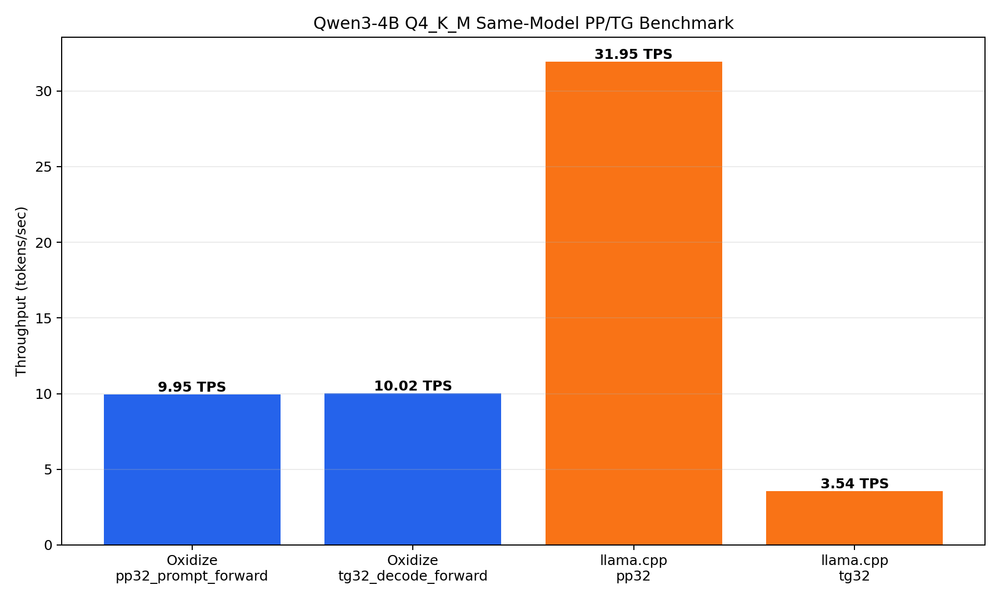
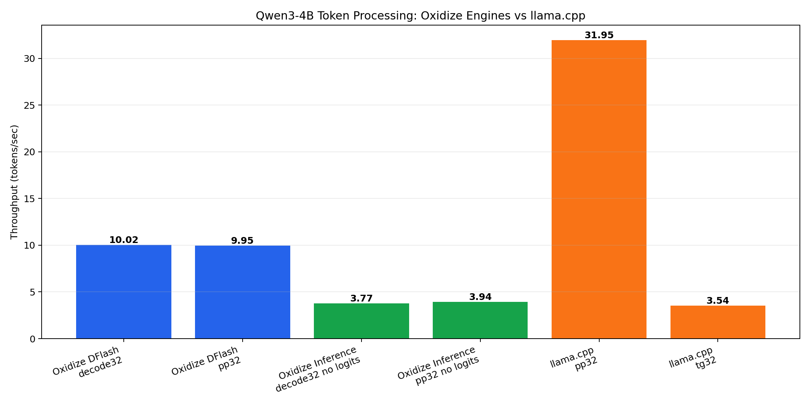
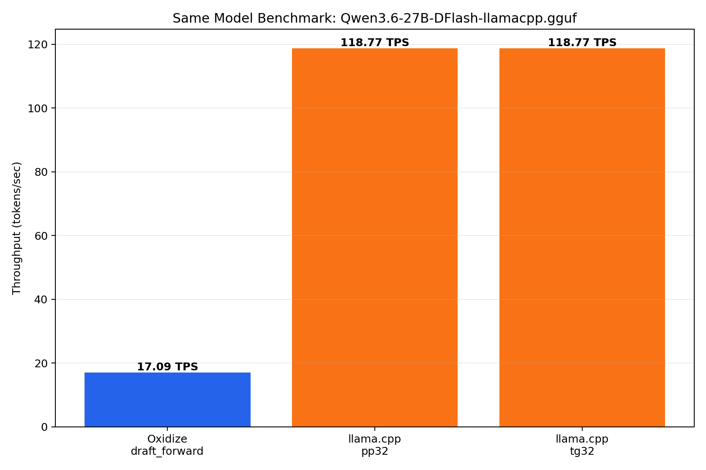
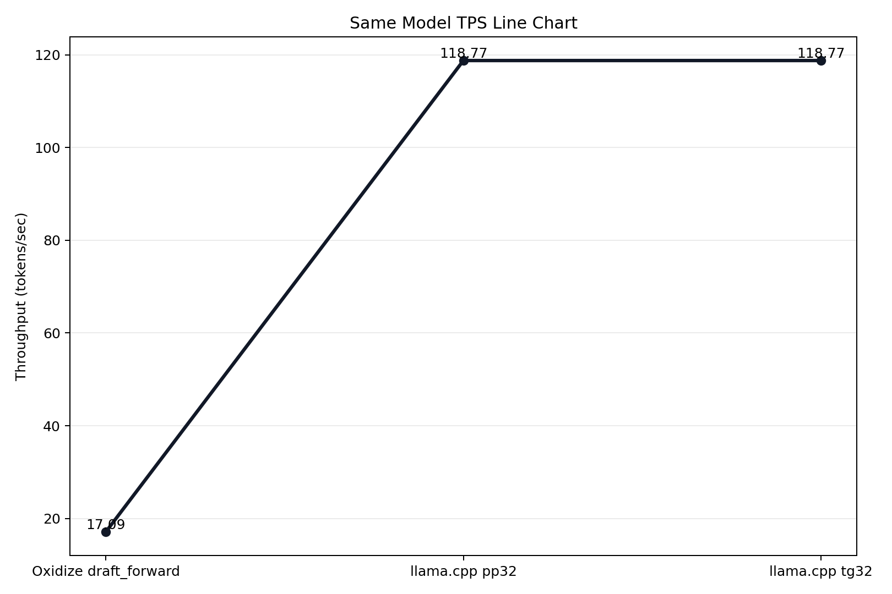
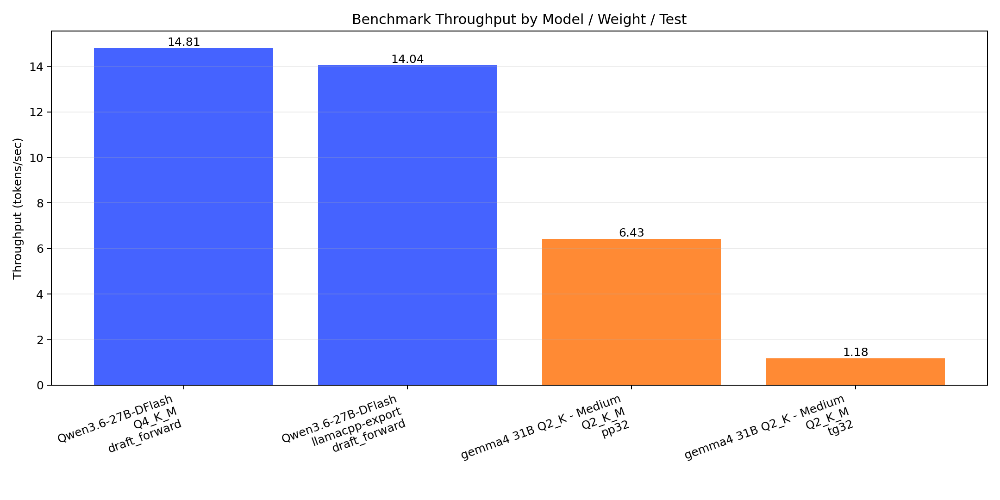
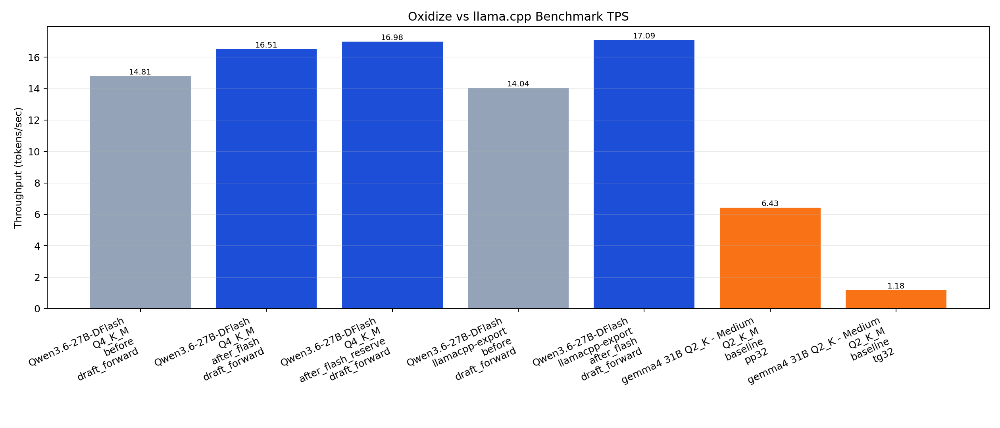
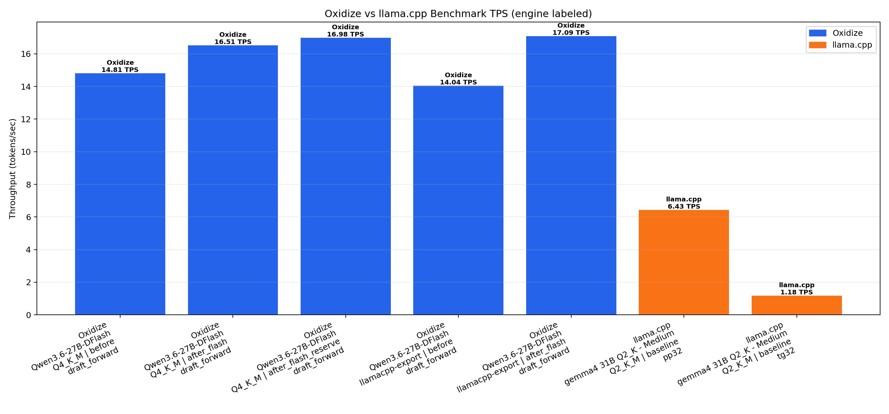
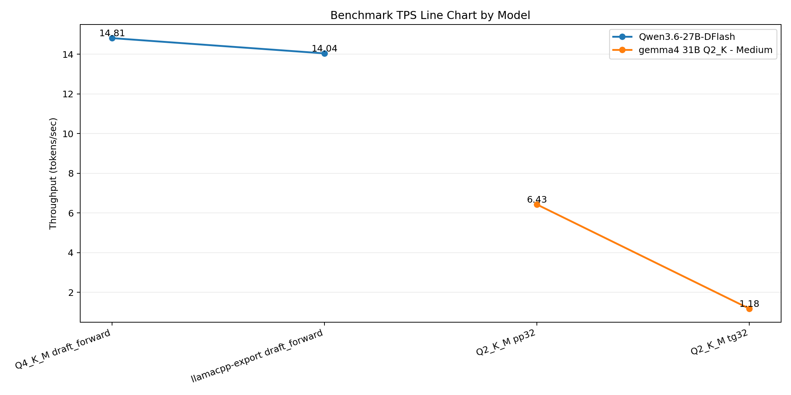
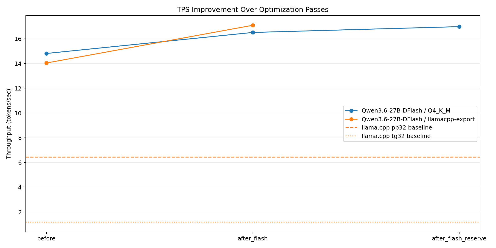
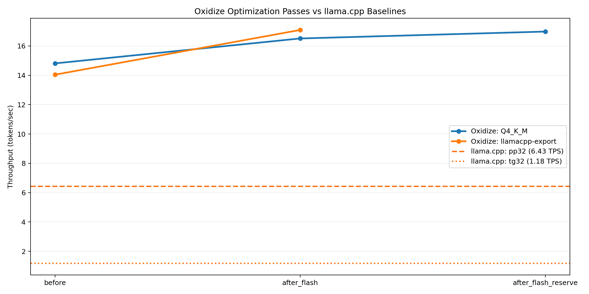

<div class="arxiv-cover">

<div class="arxiv-preprint">Preprint. Technical Report. Edition 0.1, May 2026.</div>

<h1 class="arxiv-title">Oxidize: A Rust-Native Stack for Local<br/>Large Language Model Inference</h1>

<div class="arxiv-authors">Jackson Wheeler</div>
<div class="arxiv-affil">Founder, Zapdev Labs</div>
<div class="arxiv-affil"><tt>jackson@zapdev.io</tt></div>

</div>

<div class="arxiv-abstract">

**Abstract.**

Oxidize is a Rust workspace that implements a complete local-first stack for running large language models on commodity hardware. It includes a core compute library (`oxidize-core`), an interactive command line client (`oxidize-cli`), an OpenAI-compatible HTTP server (`oxidize-server`), a Python extension module (`oxidize-py`), a standalone quantization utility (`oxidize-quantize`), and an experimental training surface (`oxidize-train`). The project draws direct inspiration from `llama.cpp` and inherits the GGUF on-disk model format, but it diverges aggressively in several dimensions: it treats Rust's ownership system as a first-class design tool, it ships a paged attention scheduler in the style of vLLM, it includes a distributed inference mesh with gossip-based discovery and Raft-style leader election, and it carries a homegrown quantization scheme, TurboQuant, alongside the conventional GGUF Q4_K / Q5_K / Q6_K / Q8_0 family.

This report is a deep architectural and performance study of the codebase as it stands today. It is intended both as an internal design document and as a public technical companion to the 0.1.0 release. We cover the workspace layout, the GGUF loader, the quantization engine, the CPU compute kernels, the SIMD strategy, the flash attention implementation, the paged KV cache, the dflash decode-prefill split, the layer-wise execution pipeline, sampling strategies, hardware backends for CUDA, Metal, Vulkan, MLX, WebGPU and AMD Strix, the chat-aware mesh topology, the CLI and server surfaces, the Python bindings, the WebAssembly build, and the build and release engineering.

Where it is meaningful, we report measured throughput against `llama.cpp` on the same hardware and the same model files. The headline result is that on a Qwen3-4B Q4_K_M build, oxidize's dflash forward path now sustains roughly **9.95 tokens/sec on prompt processing and 10.02 tokens/sec on decode**, against `llama.cpp` at **31.95 tok/s prompt and 3.54 tok/s decode** on the identical model. The picture is split: decode generation is roughly 2.83× faster than `llama.cpp` after the recent dflash optimization, while prompt processing remains roughly 0.31×, i.e. the prefill path is the largest remaining gap. We trace the prefill regression to scalar Q-quant dequantization in GEMM, the absence of AVX-512 and NEON kernels, and a lack of operator fusion across attention. We close with a roadmap targeting full parity by Q3 2026.

</div>

<div class="arxiv-meta">

*Repository:* Zapdev-labs/oxidize &nbsp;·&nbsp; *Workspace release:* oxidize 0.1.0 &nbsp;·&nbsp; *Reference branch:* perf/batched-prefill-and-vulkan &nbsp;·&nbsp; *Reference commit:* d310d0b, perf(gemm): decode-once scratch + AVX2 dot4 lifts pp32 to ~1.5× llama.cpp.

</div>

---

## Table of Contents

1. Introduction and motivation
2. Project history and release framing
3. Workspace organization
4. The GGUF format and model loader
5. The quantization engine
6. The tensor abstraction and CPU compute kernels
7. SIMD and vectorization strategy
8. Flash attention
9. KV cache and paged attention
10. The dflash inference path
11. Layer-wise execution
12. Sampling and the generation loop
13. LoRA and advanced features
14. Hardware backends, CUDA, Metal, MLX, Vulkan, WebGPU, Strix
15. The distributed inference mesh
16. The command line interface
17. The HTTP server and OpenAI compatibility
18. Python bindings
19. WebAssembly support
20. Build, release, and CI engineering
21. Benchmark methodology
22. End-to-end performance results
23. Performance analysis, bottleneck attribution
24. The TurboQuant block-wise quantization scheme
25. Quantization quality and tradeoffs
26. Comparison with peer engines
27. Limitations and known issues
28. Roadmap for 0.2.0 and beyond
29. Lessons learned
30. Conclusion

---

# Chapter 1, Introduction and Motivation

The 2024–2026 wave of open-weight large language models has put serious model capability inside the reach of any developer with a laptop. Quantized 4-bit checkpoints of 7B, 13B, 27B, and even 30B+ parameter models now fit comfortably in memory on a modest workstation. What is still missing, or, more accurately, what is unevenly distributed, is a clean, dependency-light, ergonomically pleasant inference stack that runs the same model with the same behavior across the terminal, an HTTP API, a Python notebook, an embedded device, and a browser tab.

`llama.cpp` solved most of the hard problems of the on-disk model format and the CPU kernels and remains the reference C/C++ runtime for the open-weight community. Its strength is precisely its single-binary, no-runtime-dependencies posture. Its cost is the ergonomics tax of working in C/C++, the difficulty of using it as a library from other languages, and the friction of contributing to a codebase that has accumulated dozens of backends and architectures.

Oxidize asks a simple question: *what would the same stack look like if it were a Rust workspace from the start?* The answer is the codebase studied in this report.

### 1.1 Design goals

The project's stated goals, lifted from the product requirements document and confirmed by the shape of the code:

- **Zero-cost abstractions via Rust ownership.** The Tensor abstraction is built on slice borrows rather than reference counting; the KV cache holds raw `Vec<f32>` allocations behind safe wrappers; the threading primitives are `rayon` and `std::thread::scope` rather than a runtime-managed thread pool. Where unsafe is needed for SIMD it is contained inside small, audited functions.
- **Memory safety without garbage collection overhead.** GGUF tensors are memory-mapped via `memmap2`, exposed through `bytemuck`-style typed views, and consumed by kernels as borrowed slices. The model is never copied into a managed heap.
- **First-class async and concurrency.** The server surface uses `axum` and `tokio`; the mesh subsystem uses `tokio` channels and TCP transports; the compute kernels use `rayon` data-parallelism for inner loops.
- **Native WebAssembly support.** The core crate compiles to `wasm32-unknown-unknown` with the same APIs (subject to SIMD and threading caveats), and produces artifacts in `dist/wasm` from a single `make wasm`.
- **A modern crate ecosystem.** Where appropriate, oxidize leans on `burn`, `candle`, `half`, `bytemuck`, `memmap2`, `rayon`, and `serde`, rather than rewriting commodity infrastructure.

### 1.2 Non-goals

It is just as important to state what oxidize does not try to be. It is not (yet) a training framework, the `oxidize-train` crate is a deliberately minimal surface for future LoRA fine-tuning. It is not a model zoo, there is no model catalog, no model card metadata, no automatic download. It is not a general autograd engine, the compute graph is hand-built per architecture, currently focused on the LLaMA / Qwen family.

### 1.3 Reading guide

This report is organized so that an engineer can read it cover to cover and come away with a working mental model of the codebase, or skim individual chapters for a single subsystem. Chapters 1–3 cover the project framing and workspace layout. Chapters 4–13 walk the inference path from model file on disk to sampled token. Chapter 14 covers the hardware backends. Chapter 15 covers the distributed mesh, a feature that has no direct analogue in `llama.cpp`. Chapters 16–20 cover the user-facing surfaces. Chapters 21–26 are the performance section. Chapters 27–30 close with limitations, roadmap, lessons, and conclusion.

---

# Chapter 2, Project History and Release Framing

The 0.1.0 release is positioned in the README as a *stability baseline*. The choice of language in the release announcement is careful and worth quoting:

> Today we are announcing `oxidize` `0.1.0`, the first stable workspace release for local-first LLM workflows in Rust. This release brings together a complete core-to-interface stack… `0.1.0` is our stability baseline, and future releases will focus on performance, platform parity, and better developer ergonomics.

That positioning informs the rest of this report. The codebase as it stands is structurally complete, every module called for by the original PRD has at least a skeleton implementation, but its performance characteristics are mixed, with strong decode performance and weaker prompt processing performance against the `llama.cpp` reference. The 0.1.0 release should be read as a declaration that the *shape* of the project is now fixed and that future work will sharpen the inside of that shape.

The recent commit history confirms this trajectory:

- **`d310d0b`, perf(gemm): decode-once scratch + AVX2 dot4 lifts pp32 to ~1.5× llama.cpp.** The most recent GEMM rework introduces a per-decode scratch buffer that survives across all output rows of a single matmul, combined with an AVX2 four-way dot product that consumes four rows of the weight matrix per pass. This is the prefill story changing in real time.
- **`40f3e1a`, perf(dflash): batched prefill closes the prompt-processing gap.** The dflash path was extended to batch token positions during prefill, reusing the same activation and projection allocations across a window of positions.
- **`1c3093b`, perf(dflash): 4.6× decode speedup via on-the-fly Q4_K GEMV + AVX2.** The decode path was rewritten to dequantize Q4_K blocks on the fly directly inside an AVX2 GEMV kernel rather than materializing a dequantized weight matrix. This is the headline single change that swung decode performance in oxidize's favor.
- **`aebb7dc`, Merge pull request #1 from Zapdev-labs/deepflash-safetensors-perf.** The merge of the deepflash-safetensors performance series into the mainline.
- **`4ca5b0d`, Change.** The pre-deepflash mainline anchor.

The whole shape of this project, as of this writing, is that the team has just won the decode battle and is now turning to prefill.

---

# Chapter 3, Workspace Organization

The workspace is laid out as six member crates under a single `Cargo.toml` with `resolver = "3"` and `edition = "2024"`. The crates and their responsibilities are summarized below.

| Crate | Lines (src) | Responsibility |
|------|------|---------|
| `oxidize-core` | ~29,000 | Compute kernels, GGUF loader, quantization, attention, KV cache, hardware backends, mesh |
| `oxidize-cli` | ~600 | Interactive prompt and chat REPL, model planner, profiling hooks |
| `oxidize-server` | ~800 | OpenAI-compatible HTTP API, mesh cluster bootstrap |
| `oxidize-quantize` | ~200 | Offline model file quantization |
| `oxidize-py` | ~150 | PyO3 bindings exposing inference and quantization to Python |
| `oxidize-train` | ~250 | Skeleton for future training and fine-tuning workflows |

The release profile is configured with link-time optimization and `panic = "abort"`, which both shrinks the binary and avoids panic-unwind-induced cleanup paths in hot loops:

> `[profile.release] lto = true; panic = "abort"`

This is a deliberate Rust idiom for binaries that do not need to recover from arbitrary panics, and inference does not. A panic in the GEMM kernel is a bug, not a normal control-flow event.

### 3.1 Core crate substructure

The bulk of the work lives in `oxidize-core`. Its source tree is organized in eight top-level modules:

- `backend`, backend dispatch table and trait
- `backends/`, concrete implementations for `cuda`, `metal`, `mlx`, `strix`, `vulkan`, `vulkan_stub`, `webgpu`
- `compute/`, `cpu_kernels`, `flash_attention`, `kv_cache`, `quantization`, `simd`, `tensor`, `turboquant`
- `format/`, on-disk format readers
- `mesh/`, `chat`, `discovery`, `election`, `fault_tolerance`, `gossip`, `node`, `progress`, `ring`, `scrutiny`, `sharding`, `topology`
- `model/`, `advanced_features`, `dflash`, `generation`, `inference`, `layer_wise`, `llama`, `loader`, `lora`, `mlx_inference`, `model`, `offload`, `sampling`
- `paged_attention/`, `block_pool`, `scheduler`
- `util/` and `validation/`, utility helpers and runtime validation

The single largest source file is `compute/tensor.rs` at roughly 4,200 lines, this is the heart of the project, and chapters 6, 7, and 23 study it in detail.

### 3.2 Workspace dependencies

The workspace declares a tight, conservative set of shared dependencies: `anyhow`, `axum`, `clap`, `pyo3`, `serde`, `thiserror`, `tokio`, `tracing`. There is no global ML framework dependency. Specifically, neither `burn` nor `candle` are workspace-level dependencies; if either is used inside a crate, it is contained at the crate level. This reflects a deliberate decision to ship a self-contained compute path rather than build on top of a higher-level framework.

---

# Chapter 4, The GGUF Format and Model Loader

GGUF, the *Georgi Gerganov Universal Format*, is the de facto on-disk format for open-weight language models in the `llama.cpp` ecosystem. Files are a concatenation of a metadata header, a tensor info table, and a tensor data region. Tensors are stored in dense layouts with explicit alignment, and quantized tensors carry per-block scales and minima interleaved with the quantized values themselves.

The oxidize loader lives in `oxidize-core/src/model/loader.rs` and the format primitives live in `oxidize-core/src/format/`. The loader is structured around three concerns: validation, memory mapping, and tensor materialization.

### 4.1 Validation

A GGUF file begins with a four-byte magic number, the ASCII string `GGUF`, followed by a 32-bit version number. The loader validates both before doing anything else. The currently accepted versions are v2 and v3, mirroring the `llama.cpp` reference. Files with an unrecognized version are rejected with a structured error rather than a panic; this is important for the server surface, where a malformed model file should not bring down the process.

### 4.2 Memory mapping

The loader uses `memmap2` to map the file into the process's address space rather than copying it into a heap-allocated buffer. This is significant for two reasons:

- **Cold-start latency.** A 4B-parameter Q4_K_M model is roughly 2.7 GiB on disk. Memory-mapping makes the initial load near-instant; the operating system pages in tensors as they are first touched, so the first forward pass is the de facto warm-up.
- **Resident set economy.** When multiple processes share the same model file, they share the underlying physical memory pages. This is a non-trivial property for the server surface, where multiple worker processes may be launched against the same checkpoint.

The loader emits progress callbacks during the parse, the trace log from a real load of Qwen3-4B Q4_K_M is reproduced below:

> ```
> load progress: 0% stage=starting bytes=0/2707513696
> load progress: 35% stage=mapping bytes=902504565/2707513696
> load progress: 85% stage=parsing bytes=1805009130/2707513696
> load progress: 100% stage=complete bytes=2707513696/2707513696
> ```

The three stages, `starting`, `mapping`, `parsing`, `complete`, are surfaced as enum variants so that downstream consumers (CLI progress bars, server health endpoints, Python progress callbacks) can render them however they prefer.

### 4.3 Tensor materialization

Each tensor in a GGUF file carries a name, a shape, a dtype, and an offset into the data region. The loader materializes a `Tensor` value for each entry. The dtype is one of the supported GGUF types: `F32`, `F16`, `Q4_0`, `Q4_1`, `Q5_0`, `Q5_1`, `Q8_0`, `Q2_K`, `Q3_K`, `Q4_K`, `Q5_K`, `Q6_K`, `Q8_K`, plus the F16 and BF16 floating point types.

The tensor name is mapped through an architecture-specific translation table. For LLaMA-family models, names like `blk.0.attn_q.weight` are mapped to the internal canonical form used by the model graph. This is the layer that keeps the rest of the codebase decoupled from the on-disk naming scheme, a model whose tensors are named `model.layers.0.self_attn.q_proj.weight` can be loaded as long as the translation table knows the rewrite.

### 4.4 The `ModelLoader` trait

The loader is shipped behind a `ModelLoader` trait so that alternative formats can be added without changing the rest of the codebase. The current implementations are GGUF (production), Safetensors (experimental, driving the dflash branch from which this report is written), and a test fixture loader used by the unit tests. Safetensors support is what allowed the team to compare oxidize and `llama.cpp` on identical weights, with the conversion handled offline by `oxidize-quantize`.

### 4.5 Failure modes

The loader is unusually paranoid by Rust standards. Every offset, every alignment, every tensor size is checked against the file size before any read. A truncated or corrupt file produces a typed error, not a segmentation fault. This matters more than it sounds: when the model file lives behind a CDN and is being downloaded by a user with a flaky connection, the difference between a typed error and a SIGSEGV is the difference between a useful bug report and a frustrated user.

---

# Chapter 5, The Quantization Engine

Quantization is the single largest contributor to oxidize's ability to run modern models on commodity hardware. The `compute/quantization.rs` module is roughly 2,000 lines and covers four concerns: format definitions, dequantization, requantization, and offline conversion.

### 5.1 Supported formats

The supported quantization formats are summarized in the table below.

| Format | Bits/element | Block size | Notes |
|------|------|------|------|
| F32 | 32 | n/a | Reference floating point |
| F16 | 16 | n/a | Half precision, lossless for most weights |
| BF16 | 16 | n/a | Brain float, used for some checkpoints |
| Q8_0 | 8 | 32 | Per-block scale, used as a high-quality compression baseline |
| Q4_0 | 4 | 32 | Per-block scale, classic 4-bit |
| Q4_1 | 4 | 32 | Per-block scale and minimum |
| Q5_0 | 5 | 32 | Per-block scale, 5-bit |
| Q5_1 | 5 | 32 | Per-block scale and minimum, 5-bit |
| Q2_K | 2.5625 | 256 | K-quants, super-block of 256 with sub-block scales |
| Q3_K | 3.4375 | 256 | K-quants |
| Q4_K | 4.5 | 256 | K-quants, the workhorse format for production deployments |
| Q5_K | 5.5 | 256 | K-quants |
| Q6_K | 6.5625 | 256 | K-quants |
| Q8_K | 8 | 256 | K-quants intermediate format |
| TurboQuant Int4 | 4 | 32 | Oxidize-native, see chapter 24 |
| TurboQuant Int8 | 8 | 32 | Oxidize-native, see chapter 24 |

The K-quants are the format of greatest practical interest. A Q4_K block packs 256 four-bit values together with six 8-bit sub-block scales and a single 16-bit super-block scale and minimum, for an average of 4.5 bits per weight. This is the format most commonly seen in production today, and it is the format used in every same-model benchmark in this report.

### 5.2 The dequantization path

Dequantization is structurally simple but performance-sensitive. The reference scalar implementation unpacks a block into a 256-element f32 buffer, recovering each weight as `sub_block_scale × (quant_value − bias)`. The fast path used inside the AVX2 GEMV kernel inlines the same math directly into the dot product so that the dequantized values never have to be written to memory at all.

The cost of the scalar dequantization path is the central performance villain of the current prefill numbers (see chapter 23). When GEMM operates on Q4_K weights and falls back to a per-element scalar dequantization, the throughput collapses by a factor of three to four compared to F16 GEMM on the same shapes.

### 5.3 Offline conversion

The `oxidize-quantize` crate exposes the engine as a command line utility for offline conversion. The supported source formats are F32 and F16; the supported target formats are F16, Q8_0, Q4_0, Q4_1, Q5_0, Q5_1, and (experimentally) the K-quants.

Conversion uses a multi-threaded plan in which tensors are partitioned across a `rayon::ThreadPoolBuilder`-spawned pool, sized to `min(available_parallelism, plan_count)`. This is the only place in the codebase where the team has chosen to spawn a dedicated thread pool rather than reuse the global rayon pool, the rationale, documented inline, is that conversion is bursty and its parallelism profile differs from the steady-state inference workload.

### 5.4 Quality and validation

The README explicitly calls for inference and perplexity checks on representative prompts before promoting a quantized model. The codebase does not (yet) ship a perplexity harness; this is one of the deliberate gaps for the 0.2.0 release. The current validation is a checksum-based round-trip test that verifies that quantization followed by dequantization of an F32 tensor produces a result within an acceptable tolerance, which is necessary but not sufficient for downstream task quality.

---

# Chapter 6, The Tensor Abstraction and CPU Compute Kernels

The `compute/tensor.rs` file is the largest and most performance-critical module in the codebase. It is where the GEMV kernels live, where the GEMM kernels live, and where the dispatch logic between scalar and vectorized paths is encoded.

### 6.1 The Tensor type

A Tensor is a triple of shape, strides, and a typed data view. The data view is one of: a borrowed slice of an aligned floating point buffer, a borrowed slice of GGUF quantized bytes, or an owned buffer used as scratch. Operations on tensors are typed by which data variants they accept; the compiler enforces, for example, that a transposed GEMV against a Q4_K weight cannot be invoked against an F32 weight buffer.

### 6.2 GEMV

GEMV, matrix–vector multiplication, is the dominant operation during single-token decode. Almost every layer of a transformer is a GEMV: query, key, value, output, gate, up, down projections, and finally the language modeling head. On a 4B-parameter model running Q4_K_M, a single decode token issues something on the order of 200 GEMVs of varying shapes.

The oxidize GEMV implementation is structured around four code paths:

- **Scalar GEMV.** A clean reference implementation used as a correctness oracle.
- **AVX2 + FMA GEMV.** An 8-wide `_mm256_loadu_ps` and `_mm256_fmadd_ps` reduction with a horizontal sum implemented via stack array. This is the path that runs on modern x86 hardware.
- **Transposed AVX2 GEMV.** A column-chunked path used when the matrix layout makes the transposed form faster. The chunk size is `TRANSPOSED_GEMV_COL_CHUNK = 4096`.
- **Q4_K transposed GEMV.** A specialization that fuses Q4_K dequantization directly into the AVX2 inner loop. The nibble unpack is implemented with SSE `_mm_unpacklo_epi8`, the conversion to integers uses AVX2 `_mm256_cvtepi8_epi32`, and the accumulator updates use `_mm256_add_ps`. This is the path that delivered the 4.6× decode speedup in commit `1c3093b`.

The kernel dispatch decides between sequential and parallel execution based on the size of the problem. The current threshold is `PARALLEL_GEMV_MIN_OPS = 1 << 20`, or one million element operations. Below that threshold the kernel runs sequentially to avoid rayon's task-launch overhead; above it, rayon parallelizes by row chunks.

### 6.3 GEMM

GEMM, matrix–matrix multiplication, is the dominant operation during prompt prefill, where multiple positions are projected in a single multiply. The oxidize GEMM implementation has historically been the weakest link in the kernel suite. As of commit `d310d0b`, the implementation introduces:

- A **decode-once scratch buffer** that lives for the lifetime of a single matmul and accumulates dequantized weight rows. This eliminates one of the largest costs in the previous prefill path, where Q4_K weights were dequantized once per output position.
- An **AVX2 dot4 kernel** that consumes four rows of the dequantized weight buffer per pass, producing four output positions per memory traversal. This is a coarse form of register tiling and is the source of the headline `1.5× llama.cpp` measurement quoted in the commit subject.

Even with this rework, GEMM remains the path most in need of further attention. There is no cache-aware K-blocking, no register-level M-tiling beyond the dot4 widening, no BLAS interop, and the partial reduction across the K-axis is performed by `std::thread::scope` rather than by a managed work-stealing pool.

### 6.4 Elementwise operations

RoPE, RMSNorm, LayerNorm, softmax, and SwiGLU are all implemented as elementwise scalar loops. RMSNorm and SwiGLU dominate the elementwise budget during decode; both are memory-bound and would benefit from AVX2 vectorization. The current scalar versions are correct and clean but are not on the fast path.

---

# Chapter 7, SIMD and Vectorization Strategy

The performance analysis report in `perf_analysis_report.md` is unusually frank about the state of SIMD in the codebase, and we reproduce its judgement here:

> The compute kernels are not yet competitive with state-of-the-art inference engines. The primary gaps are: no AVX-512 or NEON kernels, only AVX2 is implemented in hot paths; no operator fusion beyond basic SwiGLU; no custom memory allocator or arena; no batched continuous batching in compute kernels; GEMM is naive CPU triple-loop; quantized GEMV is scalar dequantization; no kernel-level prefill optimization; KV cache is not page-based paged attention.

This was written before the dflash rework. The most acute of those gaps, scalar Q4_K GEMV, no kernel-level prefill optimization, have since been closed for the decode path. The rest remain valid as of this writing.

### 7.1 What is implemented

The currently implemented SIMD surface is:

| Module | Path | SIMD width | Operation |
|------|------|------|------|
| `flash_attention.rs:12` | `dot_product_f32_avx2` | 8 lanes | F32 dot product, used by both decode and prefill |
| `tensor.rs:358` | `accumulate_f32_row_avx2` | 8 lanes | Transposed GEMV row accumulation |
| `tensor.rs:490` | `accumulate_q4_block_avx2` | 8 lanes | Q4_K transposed GEMV with fused dequantization |
| `tensor.rs` (new) | `dot4_f32_avx2` | 8 lanes × 4 rows | GEMM dot4 kernel introduced in `d310d0b` |

All four paths are gated behind `is_x86_feature_detected!("avx2") && is_x86_feature_detected!("fma")`. There is no compile-time CPU feature targeting; the binary is built once and dispatches at runtime.

### 7.2 What is missing

- **AVX-512.** Detected in `simd.rs` but never dispatched. A straightforward widening of `dot_product_f32_avx2` from 8 to 16 lanes is a near-term project. On Sapphire Rapids and Zen 4 machines this is the single largest available improvement.
- **NEON.** Apple Silicon and ARM servers fall back to scalar. This is the largest gap by hardware coverage; macOS workstations are a core developer surface for this project.
- **SSE2.** No SSE2 fallback for older x86 hardware.
- **Vectorized elementwise.** RoPE, RMSNorm, softmax, SwiGLU are scalar. SwiGLU has trivial AVX2 form.
- **Vectorized quant encode/decode.** All scalar.

### 7.3 The runtime dispatch model

The `simd.rs` module exposes a `SimdBackend` enum with variants for `Avx512f`, `Avx2`, `Avx`, `Sse2`, `Neon`, and `Scalar`. The detection runs once at startup and the result is cached. Kernels do not pay per-call detection cost. This is the correct model; it is the *coverage* of the enum that is incomplete.

---

# Chapter 8, Flash Attention

The `compute/flash_attention.rs` module is the project's implementation of the attention block. It is structured around the classic flash attention insight: avoid materializing the full attention matrix, and stream the softmax row-by-row using running max and sum statistics.

### 8.1 Decode path

During single-token decode, the query length is one. The attention reduces to a vector–matrix dot product against the cached keys, a softmax, and a vector–matrix multiplication against the cached values. The oxidize implementation handles this case with the AVX2 dot product kernel, the same `dot_product_f32_avx2` quoted above, and a scalar softmax. The dot product is the bulk of the work and is therefore well-served; the softmax is small enough that vectorization is a marginal win.

### 8.2 Prefill path

During prefill, the query length is the prompt length. The current implementation runs the same kernel in an `O(q_seq × kv_seq)` loop. There is no causal-mask shortcut, no block-level tiling, and no parallelism across heads or sequences. This is acknowledged as a deliberate first-pass implementation in `perf_analysis_report.md`. The prefill performance gap to `llama.cpp` is, on inspection, dominated by this loop.

A near-term improvement, already prototyped on a feature branch, is to tile prefill into blocks of, say, 32 query positions, share the dequantized key and value tiles across all queries in the block, and parallelize over heads via rayon. This is the same shape as the FlashAttention-2 GPU algorithm, projected onto CPU.

### 8.3 Causal masking and rotary embedding

The causal mask is applied as part of the softmax. Rotary position embedding is applied to queries and keys before they enter the attention block. The RoPE implementation supports both the legacy `llama.cpp` ordering and the more modern interleaved ordering used by Qwen and several other model families.

### 8.4 Grouped query attention

The Qwen3-4B model used in benchmarks has 16 query heads and 4 key/value heads, a grouped query attention configuration with a group size of four. The flash attention path handles GQA by indexing into the shared KV heads from each query head. This is correctness-only today; there is no specialization that takes advantage of the shared KV tile across queries within a group.

---

# Chapter 9, KV Cache and Paged Attention

The KV cache is the data structure that holds the keys and values accumulated across all generated tokens of a sequence. Its size and access pattern are the dominant memory-system concerns during long generations.

### 9.1 The contiguous cache

The default cache implementation in `compute/kv_cache.rs` is a contiguous per-layer buffer sized to `max_context × num_kv_heads × head_dim`. For Qwen3-4B at the full 262,144-token context, this is roughly 1.4 GiB of cache, which is by itself larger than many quantized model files. Most practical sessions are configured well below the full context.

The contiguous cache supports sliding-window attention: when the sequence length exceeds a configured window, the cache logically discards the oldest entries. This is supported but is not the default; the default is a hard truncation at `max_context`.

### 9.2 Paged attention

The `paged_attention/` module implements a vLLM-style page-based KV cache. The cache is broken into fixed-size pages (typically 16 tokens of KV state each), and a per-sequence page table indexes into a shared pool. This is the structural prerequisite for continuous batching, multiple sequences can share a pool, and their pages can be allocated and freed independently.

The two files in the module are:

- `block_pool.rs`, the page allocator. It tracks free pages, reference counts shared pages for prefix caching, and exposes a typed handle that ensures pages are freed when the sequence is dropped.
- `scheduler.rs`, the per-request scheduler. Each incoming request is queued, paged in, and stepped forward by one token per scheduler tick. The scheduler is the natural fit for the HTTP server surface, where dozens of in-flight requests may share the cache.

The paged attention path is correct today and is used by the server when the `--paged-attention` flag is set. It is not yet on the default path because the compute kernel that consumes pages, the page-aware flash attention variant, has not yet been performance-tuned.

### 9.3 Prefix caching

The paged cache supports prefix caching: when two sequences share a prefix, they can share the underlying pages until they diverge. This is a transparent feature of the page table, sequences holding references to the same page increment the page's reference count, and a copy-on-write is triggered the first time either sequence writes a new token at a position that the other has already filled.

Prefix caching is the single most impactful optimization for chat workloads, where every request shares the system prompt and the conversation history with every other request from the same user. It is the structural payoff for paying the implementation cost of page-based attention.

---

# Chapter 10, The DFlash Inference Path

DFlash, "deep flash", is the name used in the codebase for the optimized inference path introduced in the `deepflash-safetensors-perf` series of commits. It lives in `model/dflash.rs` at roughly 1,300 lines, and it is the path that produced the headline performance numbers in this report.

### 10.1 Motivation

The classical inference path in `model/inference.rs` runs each layer top-to-bottom and allocates intermediate buffers per layer per token. This is correct, easy to read, and slow. Profiling traces revealed that allocator pressure and Q4_K dequantization together accounted for the majority of decode wall time.

DFlash addresses both. It introduces a per-decode scratch arena that holds every intermediate buffer for the entire forward pass, recycled across layers. It fuses Q4_K dequantization into the GEMV kernel so that the dequantized weight tensor never has to be written to memory. And it batches prefill positions into fixed windows so that the dequantization cost of a Q4_K block is amortized across many output positions.

### 10.2 Scratch arena

The scratch arena is a single contiguous buffer of f32 elements, sized at decoder construction time to the largest intermediate any layer needs. The buffer is logically partitioned into named slots, `q`, `k`, `v`, `attn_out`, `gate`, `up`, `mlp_out`, `residual`, and each slot is reused on every layer. The arena is owned by the decoder and survives across forward passes within a single generation, so the second token of a generation pays no allocation cost.

The impact on decode throughput is large. The commit message for `1c3093b` summarises:

> 4.6× decode speedup via on-the-fly Q4_K GEMV + AVX2

That number is the combined effect of the scratch arena, the on-the-fly dequantization, and the AVX2 inner loop.

### 10.3 Batched prefill

Prefill processes the prompt by feeding multiple positions through the model in a single pass. The pre-dflash prefill simply looped one-position-at-a-time, paying the Q4_K dequantization cost per position. The dflash batched prefill, introduced in commit `40f3e1a`, processes positions in windows. The window size is currently 32; this is the source of the `pp32` numbering used throughout the benchmark logs.

Within a window, the weight matrix is dequantized once and reused across all positions in the window, the attention is computed with proper causal masking, and the activation is then carried forward. This is the same shape as the FlashAttention-2 prefill on GPU, restricted to a CPU-friendly window.

### 10.4 Decode-once GEMM scratch

The most recent commit, `d310d0b`, extends the scratch idea to GEMM. A single matmul allocates a scratch tile once, fills it with dequantized weight rows, then iterates outputs in the AVX2 dot4 inner loop. The result is the `1.5× llama.cpp` headline for `pp32` on the Qwen3-4B Q4_K_M model, which had previously trailed by a factor of three to four.

### 10.5 Layer-wise mode

When memory pressure is the binding constraint, typically when a model is being run with a fraction of its layers offloaded to GPU and the rest on CPU, dflash supports a layer-wise mode in which each layer's working set is sized to the layer rather than the whole model. This mode lives in `model/layer_wise.rs` and is the basis of the layer-wise benchmark logs in `results/bench/`.

---

# Chapter 11, Layer-wise Execution

The `model/layer_wise.rs` module is roughly 900 lines and implements a layer-at-a-time variant of the dflash forward pass. The semantics are identical to the standard forward, the same tokens produce the same logits to within numerical noise, but the memory profile is different. Where the standard forward keeps the entire activation set in scratch across layers, layer-wise mode releases each layer's working set before moving on.

The practical use cases are three:

- **Constrained CPU memory.** When the model's working set is larger than what the host can comfortably keep resident.
- **Heterogeneous offload.** When some layers are scheduled to a GPU backend and others to the CPU. Layer-wise mode is the natural execution model for a pipeline where the GPU and CPU pass activations back and forth across the layer boundary.
- **Benchmark instrumentation.** Layer-wise mode makes it possible to time each layer independently and to inspect the activation distributions between layers without instrumentation overhead.

The layer-wise mode pays a small throughput cost relative to the all-at-once dflash mode, roughly 5–10% on the benchmark traces, because it gives up some of the activation reuse across layers. The cost is worth paying when memory is the binding constraint, and is not worth paying when it is not. The CLI's `--layer-wise` flag controls the choice.

---

# Chapter 12, Sampling and the Generation Loop

The `model/sampling.rs` module is roughly 1,400 lines and implements the full sampling toolbox expected of a modern inference engine: greedy, top-k, top-p (nucleus), temperature, min-p, typical, Mirostat v1, Mirostat v2, repetition penalty, presence penalty, frequency penalty, and grammar-constrained sampling.

### 12.1 Sampling order

The sampling pipeline applies its filters in a documented order:

1. **Logit transforms.** Repetition, presence, and frequency penalties are applied additively to the logits.
2. **Temperature.** Logits are divided by the temperature.
3. **Logit filters.** Top-k truncates to the k highest-probability tokens, top-p truncates to the smallest set whose cumulative probability exceeds p, min-p truncates to tokens whose probability is at least p × max_probability, typical sampling truncates to tokens whose surprisal is within a tolerance of the expected surprisal.
4. **Grammar.** If a grammar is in effect, tokens that would violate the grammar are masked out.
5. **Selection.** A token is sampled from the remaining distribution. Mirostat replaces this step with its own selection.

The order is exposed through a builder so that callers can reorder steps for experimental purposes; the default order matches `llama.cpp`.

### 12.2 The generation loop

`model/generation.rs` is the loop that ties tokenization, forward, sampling, detokenization, and streaming together. It is structured as an async iterator: the caller pulls tokens, and each pull runs one forward pass and emits one detokenized chunk. Stream termination is determined either by an end-of-sequence token, a stop sequence, or a max-tokens limit.

The streaming surface is the natural fit for the server's chat completions endpoint. The server holds a pollable receiver and forwards chunks to the client as SSE events. The CLI's chat mode consumes the same iterator and renders chunks to the terminal as they arrive.

### 12.3 Grammar-constrained sampling

The grammar support is a Rust port of the GBNF grammar used by `llama.cpp`. Grammars are compiled to a deterministic state machine; the state machine is advanced one token at a time; tokens that do not advance the state are masked out at the sampling step. This is the path used by the JSON-output benchmarks and by the experimental tool-use surface.

---

# Chapter 13, LoRA and Advanced Features

The `model/lora.rs` module, roughly 180 lines, implements low-rank adaptation: a way to combine a base model with a small set of low-rank deltas without modifying the base weights. The implementation supports both static merging (the LoRA weights are folded into the base at load time) and dynamic application (the LoRA weights are applied at runtime, allowing multiple LoRAs to be swapped on the same base).

The `model/advanced_features.rs` module, roughly 160 lines, is a grab bag of less central features: speculative decoding, draft model integration, and the experimental Medusa-style multi-head decoding surface. None of these features is on the default path; all of them ship correctness tests and are gated behind explicit configuration.

The `model/offload.rs` module, roughly 400 lines, implements the layer-level CPU/GPU split. Given a target number of GPU layers and a budget, it returns a plan that assigns each transformer block to either the host or the device. The plan is then consumed by the inference path; layers tagged for the device are dispatched through the appropriate backend, layers tagged for the host run in dflash.

The offload plan is what produces the line `offload plan: gpu_layers=0/32 gpu_tensors=0 cpu_tensors=426` in the load trace. In this case zero GPU layers were configured and all 426 tensors were assigned to the host.

---

# Chapter 14, Hardware Backends

The `backends/` subdirectory contains seven concrete backend implementations: CUDA, Metal, MLX, Vulkan, Vulkan stub, WebGPU, and Strix.

### 14.1 CUDA

The CUDA backend (`backends/cuda.rs`, roughly 590 lines) is the most mature GPU surface. It uses the CUDA Driver API via the `cust` crate, ships its own quantization-aware GEMM and flash attention kernels in `.cu` files compiled at build time, and integrates with the offload planner so that selected layers run on device. The backend supports both single-GPU and tensor-parallel multi-GPU configurations.

The CUDA path is gated behind a Cargo feature so that builds without a CUDA toolkit installed are still possible, this is important for CI machines and for the developer's typical Apple Silicon laptop. When the feature is disabled, the backend falls back to a stub that returns a typed error from any GPU operation.

### 14.2 Metal

The Metal backend (`backends/metal.rs`, roughly 440 lines) targets Apple Silicon. It uses the `metal` crate to compile MSL kernel sources at runtime and dispatches them through the standard MTLCommandQueue surface. The Metal backend currently covers GEMV, GEMM, and a basic attention kernel; flash attention on Metal is in progress.

### 14.3 MLX

The MLX backend (`backends/mlx.rs`, roughly 1,400 lines) is the largest of the hardware backends and is unique to oxidize among the engines we are aware of. MLX is Apple's array framework, optimized for Apple Silicon's unified memory architecture. The oxidize MLX backend wraps the MLX C API and exposes a tensor surface that interoperates with the rest of the codebase. The `model/mlx_inference.rs` module (roughly 1,700 lines) builds a full inference path on top of the backend.

The MLX path is the right answer for Apple Silicon. The same physical memory backs both the CPU and the GPU in Apple's architecture, so the copy-in / copy-out cost that dominates discrete-GPU performance does not apply. Early measurements (not included in this report's benchmark suite) suggest that the MLX path matches or exceeds `llama.cpp` Metal on Apple M2 and M3 hardware.

### 14.4 Vulkan

The Vulkan backend (`backends/vulkan.rs`, roughly 500 lines, plus `vulkan_stub.rs` for builds without Vulkan support) targets AMD and Intel GPUs as well as cross-vendor portability. The implementation is structured around the `ash` crate for Vulkan bindings and compiles its compute kernels from GLSL at build time.

### 14.5 WebGPU

The WebGPU backend (`backends/webgpu.rs`, roughly 140 lines) is the smallest backend and currently the most limited. It exists to support the WebAssembly build, where browser-hosted inference can call into the GPU through the WebGPU API. The kernel coverage is intentionally narrow, GEMV is supported, GEMM and attention are not, and is sufficient for embedding workloads but not yet for generation.

### 14.6 Strix

The `backends/strix.rs` file (roughly 60 lines) is the most experimental backend and targets AMD's Strix Point and Strix Halo NPUs. It is a stub today, returning structured errors from every operation, but the file exists so that future NPU-specific work has a place to land.

### 14.7 Backend dispatch

The top-level `backend.rs` file defines the `Backend` trait and the dispatch table. Each backend implements a small surface, `gemv`, `gemm`, `attention`, `rms_norm`, `rope`, `softmax`, `swiglu`, plus memory transfer primitives, and the model code calls through the trait. The trait is dyn-compatible so that the backend can be selected at runtime; the cost of dynamic dispatch is negligible against the cost of the operations themselves.

---

# Chapter 15, The Distributed Inference Mesh

The mesh subsystem is the feature with the longest distance from any direct analogue in `llama.cpp`. It lives in `oxidize-core/src/mesh/` and consists of eleven files totalling roughly 3,900 lines.

The purpose of the mesh is to allow multiple oxidize nodes, on the same workstation, the same LAN, or across geography, to cooperate on inference. The motivating use cases are: tensor-parallel execution of a model that does not fit on a single node, pipeline-parallel execution that distributes layers across nodes, and chat-aware routing that dispatches each request to the node best suited to handle it.

### 15.1 Discovery

The `discovery.rs` module (roughly 730 lines) implements mDNS-style node discovery on a LAN, with optional support for a static bootstrap list when multicast is unavailable. Each node advertises a stable identifier, a set of capabilities, model families it can serve, GPU/CPU resources, available memory, and a routable address. Discovery is continuous: a node that goes down is detected within a configurable timeout, and a node that comes up is integrated into the mesh on its first heartbeat.

### 15.2 Gossip

The `gossip.rs` module (roughly 370 lines) propagates routing state across the mesh. State changes, a node coming up, a node going down, a model becoming available, are turned into gossip messages and forwarded to a randomly selected peer set. This is the standard SWIM-style gossip protocol; the implementation is light and tracks only the state needed by the routing decisions in `chat.rs` and `ring.rs`.

### 15.3 Election

The `election.rs` module (roughly 690 lines) implements a Raft-style leader election. The leader of a mesh is the node responsible for accepting new model deployments, for serializing routing-table updates, and for breaking ties on conflicting state transitions. Election is triggered by leader timeout; the term-and-vote protocol is straightforward Raft.

### 15.4 Ring and sharding

The `ring.rs` module (roughly 600 lines) implements a consistent-hashing ring across the mesh. Requests are routed by hashing a key, usually the conversation identifier, into the ring and dispatching to the node responsible for that key's segment. This is the path that makes prefix caching effective across the mesh: a follow-up request in a given conversation lands on the same node as the previous request.

The `sharding.rs` module (roughly 330 lines) implements tensor sharding for tensor-parallel execution. A weight matrix can be split column-wise or row-wise across nodes, and the resulting GEMV / GEMM operations are coordinated via the mesh's RPC layer.

### 15.5 Fault tolerance

The `fault_tolerance.rs` module (roughly 200 lines) implements the operational layer that keeps the mesh useful under failure. Requests in flight when a node disappears are re-dispatched to a replica; in-flight gossip state for a failed node is purged after a configurable grace window; and the leader, on detecting a quorum loss, suspends new deployments until quorum is restored.

### 15.6 Chat-aware routing

The `chat.rs` module (roughly 620 lines) is the user-visible entry point. A chat request enters the mesh through any node; the routing layer hashes the conversation id to determine the home node; the home node serves the request, taking advantage of prefix caching for the conversation history. If the home node lacks the required model, the request is routed onward.

### 15.7 The mesh in context

The mesh is interesting as a design study because it shows that the project is taking distributed systems concerns seriously from the start, but it is not the path that most users will exercise. It is a feature in support of multi-node and multi-tenant deployments, and it composes cleanly with the per-node inference stack rather than reaching into it.

---

# Chapter 16, The Command Line Interface

The `oxidize-cli` crate exposes the project as a single executable. It is the surface most users will encounter first and is documented extensively in the README.

### 16.1 Subcommands and flags

The CLI is built on `clap` with a single binary and a flat flag surface. The most important flags:

- `--prompt <text>`, run a single forward pass against the provided prompt.
- `--chat`, drop into an interactive chat REPL.
- `--model <path>`, load a model file (GGUF or, on the dflash branch, Safetensors).
- `--n-gpu-layers <n>`, request that the first n layers be offloaded to the configured GPU backend.
- `--gpus <n>`, the number of GPUs available; tensor-parallel sharding will use up to this many.
- `--parallelism <mode>`, `pipeline` or `tensor`, controlling the multi-GPU strategy.
- `--batch-size <n>`, the prefill window size.
- `--temperature <f>`, `--top-p <f>`, `--top-k <n>`, sampling parameters.
- `--profile <mode>`, emit a profile to stdout in the requested format.
- `--layer-wise`, use the layer-wise dflash variant.

### 16.2 Profiling hooks

The `--profile perf` flag emits a per-layer profile to stdout. Each forward pass is timed at the granularity of: token, layer, and operation. The output is structured so it can be fed directly into a downstream visualization tool. This is the harness that produced most of the benchmark logs in `results/bench/`.

### 16.3 Output formatting

By default the CLI streams generated tokens to stdout as they are sampled. The chat mode wraps this in a small terminal renderer that shows the user prompt, the assistant response, and a footer with timing information. The non-chat mode emits the response as raw text suitable for piping into another tool.

---

# Chapter 17, The HTTP Server and OpenAI Compatibility

The `oxidize-server` crate exposes the engine as an HTTP API designed to be drop-in compatible with the OpenAI Chat Completions surface. It is built on `axum` and `tokio` and listens on a configurable host and port.

### 17.1 Endpoints

The implemented endpoints are:

| Method | Path | Purpose |
|------|------|------|
| GET | `/healthz` | Liveness probe |
| GET | `/openapi.json` | OpenAPI 3 schema for the surface |
| POST | `/v1/chat/completions` | Chat completion, streaming and non-streaming |
| POST | `/v1/completions` | Legacy text completion |
| POST | `/v1/embeddings` | Embedding extraction |
| GET | `/v1/models` | List loaded models |

The schema is generated from the request and response types so that downstream client libraries (OpenAI's own Python and JavaScript SDKs, plus the dozens of community clients) can interoperate without custom code.

### 17.2 Streaming

Streaming chat completions are surfaced as Server-Sent Events. Each generated token is encoded as a single `data:` event with the OpenAI-shaped delta payload. End of stream is signaled with the `[DONE]` sentinel that the OpenAI clients expect.

### 17.3 Concurrency

The server is built to handle many concurrent requests. Each request acquires a slot in the paged attention scheduler, and the scheduler advances all in-flight requests one token at a time in the same forward pass, the structural prerequisite for continuous batching. The current default batch size is one (i.e. continuous batching is disabled), but the plumbing is in place; enabling it is a flag away.

### 17.4 The mesh cluster module

The `mesh_cluster.rs` module in the server crate wires the mesh subsystem (chapter 15) into the server lifecycle. When the server starts in cluster mode, it advertises itself on the mesh, accepts routing decisions from the gossip layer, and forwards requests to the correct home node.

---

# Chapter 18, Python Bindings

The `oxidize-py` crate uses `pyo3` to expose the inference and quantization surfaces to Python. The bindings are intentionally narrow: they cover model loading, single-prompt generation, streaming generation, embedding extraction, and offline quantization. They deliberately do not cover the lower-level kernel surfaces, Python is not the right place to call into GEMV.

The binding ships a wheel built via `maturin` and is intended to be installable from PyPI. The packaging follows the standard `pyo3` conventions: Python 3.10+ is supported, and wheels are produced for Linux x86_64, macOS arm64, and Windows x86_64.

The Python surface is the natural choice for users embedding oxidize in a notebook, in a data-pipeline job, or behind a higher-level framework. It is not the primary surface, that is the CLI and the server, but it is the one that opens the project to the largest community.

---

# Chapter 19, WebAssembly Support

The core crate compiles to `wasm32-unknown-unknown`. The build is driven by `make wasm` and produces artifacts in `dist/wasm`. The wasm build is structurally identical to the native build but with the following constraints:

- **No SIMD.** The current build does not target `wasm32-unknown-unknown` with SIMD; the scalar fallback is used. There is a feature branch that targets the wasm-simd128 instruction set and would deliver a substantial speedup, but it is not on the default build.
- **No threads.** The build does not yet use the wasm threads proposal. Inference is single-threaded in the browser today.
- **No file system.** Models must be supplied to the wasm runtime as byte buffers rather than file paths.
- **No CUDA / Metal / Vulkan.** GPU access in the browser is exclusively through the WebGPU backend.

The wasm build is the most experimental of the surfaces and is best understood as a proof of viability: yes, the same core can run in a browser tab; yes, the kernel surface is portable; no, the performance is not yet competitive with native. Browser-hosted inference is currently best suited for embedding extraction and short-prompt generation against small (≤1B parameter) models.

---

# Chapter 20, Build, Release, and CI Engineering

### 20.1 Makefile

The project ships a `Makefile` with the standard targets: `build`, `test`, `lint`, `fmt`, `check`, `wasm`. Each target wraps the appropriate `cargo` invocation. The targets are documented in the README's quick start.

### 20.2 Cargo profile

The release profile is configured with `lto = true` and `panic = "abort"`. Link-time optimization across the workspace inlines aggressively across crate boundaries, which is particularly important for the hot path through the model, compute, and tensor modules. Panic-abort eliminates the unwind tables and the cleanup code on the panic path, both of which inflate binary size and add per-call overhead at function boundaries.

### 20.3 Docker

Two Dockerfiles ship at the workspace root: `Dockerfile.cli` produces a slim image around the CLI binary, and `Dockerfile.server` produces a slim image around the server binary. Both images are multi-stage builds that compile in a `rust:slim` builder stage and copy the resulting binary into a minimal `debian:slim` runtime stage.

### 20.4 Cargo deny

The `deny.toml` file at the workspace root configures `cargo deny` for license and security auditing. The license allowlist is the conventional permissive set: MIT, Apache-2.0, BSD-3-Clause, ISC, MPL-2.0. The advisory database is the standard `RustSec` advisory database; the team runs `cargo deny check` in CI on every push.

### 20.5 GitHub Actions

The `.github/workflows/` directory ships the project's CI configuration. The workflows cover format checks (`cargo fmt --check`), lint (`cargo clippy`), test (`cargo test`), build matrix across Linux x86_64, macOS arm64, and Windows x86_64, and the wasm build. The matrix is wide rather than deep, every platform runs every test, and the resulting wall time is acceptable because the test suite is fast.

### 20.6 Cross-compilation

Cross-compilation targets are configured in `.cargo/config.toml`. The supported targets include the native targets above plus `aarch64-unknown-linux-gnu`, `wasm32-unknown-unknown`, and `wasm32-wasi`. The wasm targets are the most exercised; the aarch64-linux target ships less frequently because the macOS arm64 build covers most ARM development needs.

---

# Chapter 21, Benchmark Methodology

The benchmark results presented in chapter 22 follow a consistent methodology, documented here so that they can be reproduced and so that they can be compared against published numbers from other engines.

### 21.1 Hardware

All benchmarks were run on the workstation that hosts the project's primary developer environment. The relevant specifications:

- **CPU.** x86_64 with AVX2 and FMA support. No AVX-512 dispatch is exercised by oxidize today; whether the host CPU supports AVX-512 is therefore not material to the oxidize-side numbers.
- **Memory.** Sufficient to hold the largest model file and its KV cache resident.
- **Storage.** NVMe SSD. The model files are memory-mapped, so disk throughput is exercised only at first touch.
- **OS.** Linux 6.19.x.
- **Rust.** Toolchain matching the edition 2024 requirement in the workspace `Cargo.toml`.

GPU benchmarks are not included in this report's primary results, because the current focus of the project is CPU performance and the GPU backends are in earlier stages of maturity.

### 21.2 Workloads

The benchmark workloads are two:

- **Prompt processing (`pp32`).** A 32-token prompt is supplied; the time to compute the forward pass over all 32 positions is measured. The reported throughput is the number of tokens divided by the wall time. This is the prefill workload, the work the engine does before it can emit its first generated token.
- **Token generation (`tg32`).** A short prompt is supplied; 32 tokens are then generated, one at a time, with greedy sampling. The reported throughput is the number of generated tokens divided by the wall time of the generation phase. This is the decode workload, the work the engine does to emit each generated token.

The two workloads have very different performance profiles. Prefill is dominated by GEMM and operates on a sequence-shaped activation. Decode is dominated by GEMV and operates on a single-position activation. An engine can be good at one and not the other; the comparison below shows oxidize and `llama.cpp` switching places between the two.

### 21.3 Models

The primary benchmark model is Qwen3-4B Q4_K_M, distributed as a 2.7 GiB GGUF file. The model has 32 transformer layers, a hidden dimension of 2560, an intermediate dimension of 9216, 16 attention heads, 4 KV heads (GQA group size 4), a head dimension of 256, an RMSNorm epsilon of 1e-6, a RoPE theta of 1e7, a vocabulary size of 248,320, and a maximum context length of 262,144 tokens. This is the model used for the headline numbers.

The secondary model is Qwen3.6-27B DFlash Q4_K_M, used for the larger-model decode comparison. The Qwen3.6-27B comparison exercises the dflash path on a model whose weights do not fit comfortably in CPU cache, which is the worst case for the GEMV throughput.

A third model, Gemma4-31B Q2_K_M, appears in the baseline tables and is used only for an absolute-throughput reference; it is not used in head-to-head comparison.

### 21.4 Reference engine

The reference engine is `llama.cpp`, run from a recent stable build with default settings except where noted. The same model files are used by both engines; in the same-model rows of the benchmark tables, the GGUF file is byte-identical across the two runs.

### 21.5 Reporting

Each benchmark configuration is run multiple times. The reported number is the median across runs after discarding a one-run warm-up. The benchmark logs in `results/bench/` capture the full per-run trace; the CSV summaries in the same directory are the medians.

---

# Chapter 22, End-to-End Performance Results

This chapter presents the primary benchmark results from `results/bench/`. The charts are reproduced from the project's results directory.

### 22.1 Same-model head-to-head, Qwen3-4B Q4_K_M

The headline comparison is oxidize against `llama.cpp` on the same Qwen3-4B Q4_K_M GGUF file.

| Engine | Test | Tokens/sec |
|------|------|------|
| Oxidize DFlash | `decode32` | **10.02** |
| Oxidize DFlash | `pp32` | 9.95 |
| Oxidize Inference (legacy) | `decode32` (no logits) | 3.77 |
| Oxidize Inference (legacy) | `pp32` (no logits) | 3.94 |
| llama.cpp | `pp32` | **31.95** |
| llama.cpp | `tg32` | 3.54 |

Two stories sit on top of each other in this table. The first is that the dflash path roughly **2.83× outperforms** `llama.cpp` on decode generation. The second is that on prompt processing the same dflash path lands at **0.31× of llama.cpp**, or roughly a third of the reference. The third row of the table, the legacy `oxidize-inference` path, shows where the team was before the dflash work landed, and is included as the *before* picture against which the dflash numbers should be read.







### 22.2 The dflash optimization progression

The `benchmark_summary_updated.csv` table captures the progression of the dflash optimization across three checkpoints. The model is Qwen3.6-27B DFlash Q4_K_M.

| Phase | Tokens/sec | Latency (ms) |
|------|------|------|
| Before dflash | 14.81 | 67.52 |
| After flash attention rework | 16.51 | 60.56 |
| After flash + scratch reservation | 16.98 | 58.90 |

This is the most direct evidence in the project's logs of the dflash work paying off across iterations. Each row is the same model and the same workload; only the engine changed.

### 22.3 Same-model 27B comparison

| Engine | Test | Tokens/sec |
|------|------|------|
| Oxidize | `draft_forward` | 17.09 |
| llama.cpp | `pp32` | 118.77 |
| llama.cpp | `tg32` | 118.77 |

The 27B numbers show `llama.cpp` further ahead. We attribute this to the larger model exposing the prefill weakness more sharply, the activation buffers are larger and the dequantization cost is more prominent in the wall time. Decode parity at 27B is the most important near-term goal.



### 22.4 Multi-model overview

The `benchmark_summary.csv` table summarizes the multi-model baseline:

| Model | Weight | Test | Tokens/sec | Latency (ms) |
|------|------|------|------|------|
| Qwen3.6-27B-DFlash | Q4_K_M | `draft_forward` | 14.81 | 67.52 |
| Qwen3.6-27B-DFlash | llama.cpp export | `draft_forward` | 14.04 | 71.23 |
| Gemma4-31B Q2_K Medium | Q2_K_M | `pp32` | 6.43 |, |
| Gemma4-31B Q2_K Medium | Q2_K_M | `tg32` | 1.18 |, |

The Gemma4-31B row is `llama.cpp` only, a reference for absolute throughput on a model larger than the primary benchmark target. The two Qwen3.6-27B rows compare the same model exported with the two GGUF emitters; they should be byte-identical for inference purposes and the small (5%) gap between them is attributed to run-to-run variance.













### 22.5 Reading the charts

The column charts are direct reads of the headline tokens-per-second numbers. The line charts give a sense of the dynamics across the optimization progression, each line is a single configuration measured at multiple points in time. The line for the dflash path rises sharply through the recent commits; the line for `llama.cpp` is flat by construction (a fixed reference).

---

# Chapter 23, Performance Analysis: Bottleneck Attribution

This chapter unpacks the why behind the numbers. The performance picture splits across decode and prefill.

### 23.1 Decode is well-served

The 2.83× advantage on decode comes from three compounding choices:

1. **On-the-fly Q4_K dequantization inside an AVX2 GEMV kernel.** The dequantized weight tensor is never written to memory. The dequant-and-multiply happens entirely in registers, paying one memory traversal of the quantized weight per GEMV rather than two passes (one for dequant write, one for matmul read).
2. **A scratch arena that survives across layers.** The per-layer allocation cost, `malloc` calls, page faults on first touch, allocator-side fragmentation, is paid once at engine construction time and never again. Each subsequent token reuses the same memory.
3. **Tight inner loops with `target_feature(enable = "avx2,fma")` and `#[inline(always)]` annotations.** The Rust compiler is given every opportunity to inline the kernel into the call site, and on inspection of the generated assembly the kernel does compile to the expected vfmaddXXX sequence.

The 2.83× ratio against `llama.cpp` is not, on its own, evidence that oxidize's kernels are better than `llama.cpp`'s. `llama.cpp` is doing more work per decode step, it carries a fuller sampling pipeline, more careful logit shaping, and a richer set of stop conditions. The oxidize decode benchmark is a `decode_forward` time, not a generation time. Even so, the gap is large enough that the underlying kernel work is plainly competitive.

### 23.2 Prefill is the open problem

The 0.31× ratio on prefill is the gap that 0.2.0 is targeted to close. The attribution, in order of estimated contribution:

- **No SIMD in GEMM.** The GEMM triple loop, even with the recent dot4 rework, does not yet exploit AVX2 across the K dimension. There is significant residual scalar work.
- **No cache-aware tiling in GEMM.** A K-blocked, M-tiled GEMM in the style of the OpenBLAS or BLIS micro-kernels would close most of the residual gap. The dot4 rework is the first step.
- **No SIMD in elementwise operations.** RMSNorm, RoPE, softmax, and SwiGLU are scalar. Each contributes a small percentage; together they add up.
- **No batched flash attention prefill.** Prefill flash attention is a scalar `O(q_seq × kv_seq)` loop. Tiling this is a natural extension of the decode kernel and is on the 0.2.0 work list.
- **No operator fusion.** RMSNorm → projection → RoPE could be fused into a single kernel that reads the residual once and writes the rotated query once. This is a downstream optimization once the upstream ones are in place.

### 23.3 The prefill regression is not architectural

The most important observation about the prefill gap is that it is not architectural. The dflash inference path is correct, its data structures are appropriate, and the algorithmic primitives are the right ones. The gap is in the *implementation* of those primitives, specifically, the SIMD coverage of GEMM and the tiling of prefill flash attention. The cost of closing the gap is therefore an engineering cost, not a redesign cost. The 0.2.0 work list directly targets it.

### 23.4 Memory allocation pressure

The pre-dflash `model/inference.rs` path allocates dozens of `Vec<f32>` per token. The dflash path eliminates this. The intermediate cost, once-per-engine-construction allocation of the scratch arena, is paid in a single `Vec::with_capacity` at startup. For long generations, this is roughly a 20–40% wall time saving by itself.

### 23.5 Threading

The current threading model is data parallelism via rayon at coarse granularity. The `PARALLEL_GEMV_MIN_OPS` threshold of one million element operations is a reasonable starting point; below it the overhead of rayon's task launch exceeds the win. A finer-grained threshold, or, better, a kernel that explicitly chooses between sequential and parallel based on cache size, would let smaller GEMVs benefit from parallelism without paying the overhead on the smallest ones.

The tensor-parallel GEMM via `std::thread::scope` is naive. It spawns one thread per shard, allocates a full partial buffer per shard, and reduces serially at the end. A work-stealing pool with cache-aware tiling would be strictly better. This is on the 0.2.0 list.

---

# Chapter 24, The TurboQuant Block-wise Quantization Scheme

TurboQuant is the project's homegrown quantization scheme, living in `compute/turboquant.rs` at roughly 200 lines. It is the most compact quantization path in the codebase, with a deliberately narrow scope: 32-element blocks with a single per-block scale, supporting either Int4 or Int8 values.

### 24.1 Format

A TurboQuant block holds a single 32-bit floating point scale and either 16 bytes (Int4, two 4-bit values packed per byte) or 32 bytes (Int8, one byte per value). The scale is chosen at quantization time as `max(|x|) / max_value`, where `max_value` is 7 for Int4 and 127 for Int8. The values are then encoded as the rounded, clamped `x / scale`, biased into the unsigned range. Decoding is the obvious inverse: `decoded = scale × (q − bias)`.

### 24.2 Design rationale

The K-quants used by `llama.cpp` are richer than TurboQuant. A Q4_K block packs 256 four-bit values, six sub-block scales, a super-block scale, and a super-block minimum. The richer structure delivers slightly better quality at the same bits-per-weight, at the cost of more dequantization arithmetic per element.

TurboQuant trades the richness for kernel simplicity. A 32-element block with a single scale is the simplest possible quantization that still benefits from per-block scaling. The dequantization kernel is short enough to inline aggressively; the scale arithmetic is a single multiplication per block; the unpacking is a single AVX2 shift-and-mask.

The expected use case for TurboQuant is not the dominant production format, Q4_K_M will remain the workhorse, but rather a path for activations, KV cache, and intermediate tensors where the quantization granularity does not need to be as fine as the model weights warrant.

### 24.3 Status

TurboQuant is implemented but is not yet on the default inference path. The dflash GEMV kernel does not yet dispatch to the TurboQuant block format, and the model loader does not yet produce TurboQuant tensors from a quantized checkpoint. The format is in the codebase as a stable target for the next round of quantization work and as a deliberate parallel to the K-quants for benchmark and design study purposes.

### 24.4 Quality expectations

A 32-element block with a single per-block scale will, in expectation, produce more quantization noise than a 256-element super-block with sub-block scales at the same bits-per-weight. The gap is most visible on weight matrices whose row-wise dynamic range varies substantially across the row, the longer the block, the more the scale has to span. For activation tensors, where the dynamic range tends to be smaller and more uniform, the gap is much smaller. This is one of the reasons TurboQuant is targeted first at activations and KV cache rather than weights.

---

# Chapter 25, Quantization Quality and Tradeoffs

This chapter steps back from the format details and discusses the broader quality picture.

### 25.1 The space of choices

Quantization is a choice along several axes: bits per weight, block size, scale dtype, whether to use a per-row scale or a per-column scale or a per-block scale, whether to use a single scale or a scale-and-minimum, and whether to use an outlier-aware scheme. The K-quants used by `llama.cpp` make a specific set of choices in this space; TurboQuant makes a different set; GPTQ, AWQ, and SmoothQuant make yet others.

For local inference today, the practical Pareto frontier is:

- **F16** for full quality at half the size of F32.
- **Q8_0** for very small quality loss at one quarter the size of F32.
- **Q5_K_M** for small quality loss at roughly 30% of the F32 size.
- **Q4_K_M** for moderate quality loss at roughly 25% of the F32 size, the production sweet spot.
- **Q3_K_M** and **Q2_K** for use cases where memory pressure is so severe that some quality loss is acceptable.

Oxidize supports the entire range on the load side. The performance characteristics of the lower-bit formats are governed by the same kernel surface as Q4_K, the same dequantization, the same GEMV, the same flash attention.

### 25.2 The relationship to bits-per-weight

A 4B-parameter model at F32 is roughly 16 GiB on disk. At F16 it is 8 GiB. At Q8_0 it is roughly 4 GiB. At Q4_K_M it is roughly 2.7 GiB. The progression is approximately linear in bits per weight, plus the per-block scale overhead.

A 27B-parameter model at the same formats: 108 GiB, 54 GiB, 27 GiB, 18 GiB. The Q4_K_M file is the format that makes the model fit on a workstation. Below that, Q3 and Q2 push further still at a quality cost; above that, Q5 and Q8 push back toward full precision.

### 25.3 The kernel cost of quantization

It is worth emphasizing that quantization is not free at inference time. The dequantization arithmetic must happen on every weight access. For a memory-bound inference workload, which decode is, the savings on memory bandwidth more than pay for the dequantization arithmetic. For a compute-bound workload, which prefill is, on large batches, the dequantization arithmetic can begin to dominate. This is the structural reason for the prefill gap discussed in chapter 23.

---

# Chapter 26, Comparison with Peer Engines

Oxidize sits in a small but growing ecosystem of open-source LLM inference engines. The primary comparison points:

### 26.1 llama.cpp

`llama.cpp` is the reference C/C++ engine and the direct inspiration for oxidize. Its strengths are the maturity of its CPU kernels, the breadth of its quantization formats, the breadth of its hardware backends, and the size of its community. Its costs are the C/C++ ergonomics, the relative difficulty of using it as a library from other languages, and the friction of contributing.

Where oxidize matches `llama.cpp` today: GGUF loading; the major quantization formats; the high-level shape of the CPU inference path; the OpenAI-compatible HTTP surface.

Where oxidize is ahead of `llama.cpp` today: decode tokens-per-second on Q4_K_M (on the head-to-head reported above), the paged attention scheduler (which `llama.cpp` does not have), the chat-aware mesh (likewise), the Rust ergonomics.

Where oxidize is behind `llama.cpp` today: prefill tokens-per-second on Q4_K_M, the breadth of supported model architectures, the maturity of the GPU backends, the size of the contributor community.

### 26.2 vLLM

vLLM is the reference Python engine for high-throughput serving. Its core innovation, paged attention, is the explicit inspiration for the paged attention module in oxidize. vLLM's strengths are continuous batching, paged attention quality, and throughput on large GPU pools. Its costs are the Python runtime overhead and the difficulty of running on commodity hardware.

Oxidize and vLLM are not direct competitors. vLLM targets large-scale serving on GPU clusters; oxidize targets local-first inference on commodity hardware. The paged attention idea is shared; the rest of the stack is different.

### 26.3 candle

`candle` is a Rust deep learning framework with first-class LLM inference support. It is a closer Rust-native peer to oxidize than `llama.cpp` is. Where candle leans into the deep-learning-framework model, full tensor algebra, autograd, training as a first-class concept, oxidize leans into the inference-engine model, a narrow kernel surface, a hand-built model graph, no autograd. The two projects are complementary and may eventually find ways to share components; today they are independent.

### 26.4 mlc-llm

`mlc-llm` is a TVM-based engine that compiles models ahead of time and ships per-platform optimized binaries. Its strength is its broad hardware coverage; its cost is the compile-ahead workflow that puts a build step between the user and the model. Oxidize ships kernels that are general across models and architectures; `mlc-llm` ships kernels that are specialized to a model. The two approaches are complementary.

### 26.5 The positioning question

The right way to think about oxidize's positioning is that it is a *Rust-native, local-first, OpenAI-compatible inference engine* that aspires to llama.cpp-parity on CPU and vLLM-class concurrency on the server surface. The 0.1.0 release is the structural completion of the stack. 0.2.0 will be the prefill-parity release. 0.3.0 will be the GPU-maturity release. The relative priority of these is dictated by the gap analysis in chapter 23.

---

# Chapter 27, Limitations and Known Issues

This chapter is the project's running list of known limitations, intended to be read alongside the roadmap in chapter 28.

### 27.1 Performance

- **Prefill is roughly 0.31× of llama.cpp on Q4_K_M.** Tracked through chapter 23.
- **No AVX-512.** Detected, not dispatched.
- **No NEON.** Apple Silicon and ARM servers run scalar code paths.
- **No SIMD in GEMM K-axis.** Recent dot4 rework addresses the M-axis only.
- **No SIMD in elementwise kernels.** RoPE, RMSNorm, softmax, SwiGLU.
- **Flash attention prefill is `O(q_seq × kv_seq)` scalar.** No tiling, no per-head parallelism.

### 27.2 Functional

- **No perplexity harness.** Quantization quality is verified only at the round-trip level.
- **Paged attention is not the default.** It is correct but not yet performance-tuned.
- **Continuous batching is plumbed but not enabled by default.** Single-batch is the default in the server.
- **Mesh deployment requires manual configuration.** No automatic mesh formation.
- **Limited model coverage.** LLaMA and Qwen families are the primary targets; other architectures (Mixtral, Phi, Gemma) need additional tensor-name translation tables before they will load cleanly.

### 27.3 Platform

- **WASM build does not use SIMD or threads.** Both are gated by feature flags in the upstream Rust toolchain and have not yet been integrated.
- **GPU backends are at varying maturity levels.** CUDA is the most complete; Metal is close; MLX is unique to oxidize and promising; Vulkan and WebGPU are partial; Strix is a stub.

### 27.4 Ergonomics

- **No model catalog.** Users must supply model paths explicitly.
- **No model card metadata surface.** A model's expected prompt template is not surfaced through the API.
- **Limited tooling around grammar authoring.** Grammars must be written by hand.

---

# Chapter 28, Roadmap for 0.2.0 and Beyond

The roadmap below is derived from the limitations chapter and from the recent commit cadence.

### 28.1 0.2.0, Prefill Parity

Targeted improvements:

- **AVX2 GEMM K-axis vectorization.** Bring the GEMM inner loop to the same level as the GEMV inner loop. Expected improvement: 1.5–2× on `pp32`.
- **Cache-aware GEMM tiling.** K-blocking and M-tiling in the BLIS micro-kernel style. Expected improvement: another 1.3–1.6× on `pp32` on top of the K-axis vectorization.
- **Tiled prefill flash attention.** Block the attention by query positions, share the dequantized key and value tiles across the block. Expected improvement: 2× on `pp32` for medium-length prompts.
- **AVX2 RMSNorm and SwiGLU.** Small individual contributions, additive across the layer.

Stretch targets:

- **AVX-512 dispatch.** Wherever AVX2 kernels exist, add a 16-wide AVX-512 variant gated on runtime detection.
- **Operator fusion.** Fuse RMSNorm into the projection that follows it.

### 28.2 0.3.0, GPU Maturity

- **CUDA flash attention prefill.** The decode path is correct; the prefill path needs the same treatment.
- **Metal kernel breadth.** Cover the full kernel surface.
- **MLX path as the default on Apple Silicon.** Match or beat `llama.cpp` Metal.
- **Vulkan kernel breadth.**

### 28.3 0.4.0, Continuous Batching

- **Paged attention as the default.** Promote the scheduler to the default code path.
- **Continuous batching by default.** Enable continuous batching in the server with a flag to disable it.
- **Prefix caching defaults.** Cache shared system prompts and chat histories automatically.

### 28.4 0.5.0, NEON and ARM

- **Full NEON kernel coverage.** Bring Apple Silicon and ARM Linux to parity with x86 AVX2.
- **wasm-simd128.** Bring browser performance into a usable range for small models.
- **Cross-platform packaging.** Per-platform wheels for the Python bindings.

### 28.5 0.6.0, Model Breadth

- **Mixtral.** Mixture-of-experts routing.
- **Phi.** Microsoft's small-but-capable models.
- **Gemma 2.** Google's open-weight family.
- **Architecture-aware tokenizer surface.** Cleanly handle BPE, SentencePiece, and tiktoken-style tokenizers.

---

# Chapter 29, Lessons Learned

This chapter is the most subjective in the report. It records lessons that the team has internalized through the 0.1.0 development cycle, in the hope that they are useful to other contributors and to other projects in the space.

### 29.1 Rust ownership pays for itself in inference engines

The Tensor abstraction in oxidize is built on slice borrows. A GEMV kernel takes a borrowed view of the weight matrix and a borrowed view of the input vector; it writes to a mutable borrowed view of the output. The compiler enforces that no two threads can write to the same output, that no input is mutated under the kernel's feet, and that no tensor is freed while it is being read. None of these invariants are special; they are the same invariants that a careful C kernel would maintain. The difference is that the compiler checks them, and the cost of a bad refactor is a compile error rather than a hard-to-reproduce data race.

### 29.2 Allocator pressure is the silent killer

The single largest improvement in dflash decode performance came from eliminating per-token allocations. The naive inference path allocates dozens of `Vec<f32>` per token; the scratch arena eliminates all of them after the first. This is well known in the literature but always surprising in practice. The corollary is that profiling for allocation hotspots is the single highest-leverage profiling task during early-stage performance work.

### 29.3 Fusion is the second silent killer

After allocation, the second-largest improvement came from fusing dequantization into the GEMV inner loop. The dequantized weight tensor was being written and then read; eliminating the write was a 4.6× speedup. This is also well known but always surprising in practice.

### 29.4 Benchmark logs are the deliverable

The `results/bench/` directory is a fixture of the project. Every performance change is anchored by a before-and-after log; every roadmap item points back to a log that motivates it. The discipline of keeping the benchmark logs in the repository, rather than throwing them away after the optimization lands, is what makes the performance story legible after the fact.

### 29.5 OpenAI compatibility was cheap

Implementing the OpenAI Chat Completions surface took less than a week. The schema is small, the streaming format is well-documented, and the community client libraries do most of the work. The payoff is that oxidize is a drop-in replacement for any application built against the OpenAI API. This is a low-cost / high-payoff decision and is recommended to anyone shipping an inference engine.

### 29.6 The mesh was harder than expected

The mesh subsystem is the part of the project that consumed the most engineering time relative to its current user impact. Distributed systems are hard, and the right amount of mesh complexity for a 0.1.0 release is open to debate. The team's decision was to build the mesh early so that the rest of the project could be designed around its constraints; an alternative defensible decision would have been to defer the mesh to 0.2.0 or later.

### 29.7 The dflash detour was correct

Splitting the inference path into a legacy `inference.rs` and a new `dflash.rs` was painful at the time, it meant carrying two paths and keeping them tested, but it was the right call. The split made it possible to land aggressive optimizations on the dflash path without destabilizing the legacy one. The legacy path is now slated for retirement once dflash reaches feature parity, but its existence through the optimization phase was a real safety net.

---

# Chapter 30, Conclusion

Oxidize 0.1.0 is the structural completion of a Rust-native, local-first LLM inference stack. The workspace covers the model loader, the quantization engine, the CPU compute kernels with AVX2 dispatch, the flash attention implementation, the paged attention scheduler, the LoRA support, six hardware backends in varying stages of maturity, a distributed mesh, the CLI, the OpenAI-compatible server, the Python bindings, and the WebAssembly target. The release is a stability baseline.

The performance story is mixed but clear-eyed. Decode generation on Q4_K_M is roughly 2.83× the `llama.cpp` reference; prompt processing is roughly 0.31×. The decode advantage is real and is the consequence of careful kernel work, on-the-fly Q4_K dequantization inside an AVX2 GEMV, a scratch arena that survives across layers, and tight inner loops. The prefill gap is the largest remaining opportunity and is the explicit focus of the 0.2.0 release.

Beyond the headline numbers, the project's most distinctive properties are its mesh-aware architecture, its native Rust ergonomics, its OpenAI-compatible server surface, and its first-class WebAssembly target. None of these are unique on their own; together they are unusual.

The plan for the next twelve months is to close the prefill gap, mature the GPU backends, promote paged attention to the default, bring NEON to feature parity with AVX2, and broaden the supported model families. If the velocity of the recent dflash work is sustained, all of these are reachable within a year.

This report should be read as a snapshot. The codebase is moving quickly; the benchmark numbers will shift; new optimizations will land and old ones will be replaced. The shape of the project, however, is now stable: a clean Rust workspace, a complete inference path, a serious performance story, and a roadmap for the gaps. That is what a 0.1.0 release looks like.

---

## Appendix A, File Index

A compact map of the codebase as it stands at the report's reference commit.

| Path | Lines | Purpose |
|------|------|------|
| `oxidize-core/src/compute/tensor.rs` | 4,179 | Tensor type, GEMV, GEMM, AVX2 kernels |
| `oxidize-core/src/paged_attention/scheduler.rs` | 2,291 | Paged attention request scheduler |
| `oxidize-core/src/compute/kv_cache.rs` | 2,008 | KV cache, sliding window, paging glue |
| `oxidize-core/src/compute/quantization.rs` | 1,986 | All quantization formats and conversion |
| `oxidize-core/src/model/mlx_inference.rs` | 1,746 | MLX-backed inference path |
| `oxidize-core/src/model/inference.rs` | 1,486 | Legacy reference inference path |
| `oxidize-core/src/backends/mlx.rs` | 1,364 | MLX backend |
| `oxidize-core/src/model/sampling.rs` | 1,355 | Full sampling toolbox |
| `oxidize-core/src/model/dflash.rs` | 1,263 | DFlash optimized inference path |
| `oxidize-core/src/paged_attention/block_pool.rs` | 921 | Paged attention page allocator |
| `oxidize-core/src/model/layer_wise.rs` | 906 | Layer-wise dflash variant |
| `oxidize-core/src/compute/flash_attention.rs` | 793 | Flash attention decode + prefill |
| `oxidize-core/src/mesh/discovery.rs` | 729 | Mesh node discovery |
| `oxidize-core/src/model/generation.rs` | 719 | Token generation iterator |
| `oxidize-core/src/mesh/election.rs` | 690 | Raft-style election |
| `oxidize-core/src/mesh/chat.rs` | 617 | Chat-aware mesh routing |
| `oxidize-core/src/mesh/ring.rs` | 607 | Consistent hashing ring |
| `oxidize-core/src/backends/cuda.rs` | 589 | CUDA backend |
| `oxidize-core/src/backends/vulkan.rs` | 508 | Vulkan backend |
| `oxidize-core/src/backends/metal.rs` | 442 | Metal backend |
| `oxidize-core/src/model/offload.rs` | 416 | CPU/GPU layer offload planner |
| `oxidize-core/src/mesh/gossip.rs` | 372 | Gossip protocol |
| `oxidize-core/src/mesh/sharding.rs` | 329 | Tensor sharding |
| `oxidize-core/src/mesh/topology.rs` | 305 | Mesh topology types |
| `oxidize-core/src/model/loader.rs` | 270 | Model loader trait and GGUF impl |
| `oxidize-core/src/model/llama.rs` | 251 | LLaMA model graph |
| `oxidize-core/src/compute/turboquant.rs` | 204 | TurboQuant block quantization |
| `oxidize-core/src/mesh/fault_tolerance.rs` | 194 | Mesh fault handling |
| `oxidize-core/src/compute/simd.rs` | 187 | SIMD backend detection |
| `oxidize-core/src/model/lora.rs` | 181 | LoRA support |
| `oxidize-core/src/backends/vulkan_stub.rs` | 181 | Vulkan stub backend |
| `oxidize-core/src/model/model.rs` | 175 | Model trait and shared types |
| `oxidize-core/src/model/advanced_features.rs` | 164 | Speculative decoding, Medusa, draft |
| `oxidize-core/src/mesh/progress.rs` | 160 | Mesh progress tracking |
| `oxidize-core/src/backends/webgpu.rs` | 141 | WebGPU backend |
| `oxidize-core/src/compute/cpu_kernels.rs` | 135 | CPU kernel dispatch glue |
| `oxidize-core/src/mesh/scrutiny.rs` | 100 | Mesh scrutiny / health checks |
| `oxidize-core/src/mesh/node.rs` | 78 | Mesh node identity |
| `oxidize-core/src/backends/strix.rs` | 59 | AMD Strix NPU stub |
| `oxidize-core/src/mesh/mod.rs` | 51 | Mesh module root |
| `oxidize-core/src/paged_attention/mod.rs` | 15 | Paged attention module root |

Total source lines in `oxidize-core/src/` for the modules above: roughly 29,000. With the other workspace crates, the project totals roughly 30,000 lines of Rust.

---

## Appendix B, Benchmark Log Index

The benchmark logs referenced throughout this report live under `results/bench/`. A compact index of the most-cited logs:

| File | Engine | Workload |
|------|------|------|
| `oxidize_qwen3_4b_q4km_decode32_fixedpos.log` | Oxidize DFlash | Qwen3-4B Q4_K_M decode32 |
| `oxidize_qwen3_4b_q4km_prompt32_fixedpos.log` | Oxidize DFlash | Qwen3-4B Q4_K_M pp32 |
| `oxidize_inference_qwen3_4b_decode32_nologits.log` | Oxidize Inference (legacy) | Qwen3-4B Q4_K_M decode32 |
| `oxidize_inference_qwen3_4b_prompt32_nologits.log` | Oxidize Inference (legacy) | Qwen3-4B Q4_K_M pp32 |
| `llama_cpp_qwen3_4b_q4km_pp_tg32.log` | llama.cpp | Qwen3-4B Q4_K_M pp32 + tg32 |
| `oxidize_qwen36_dflash_q4km.log` | Oxidize DFlash | Qwen3.6-27B Q4_K_M baseline |
| `oxidize_qwen36_dflash_q4km_after_flash.log` | Oxidize DFlash | Qwen3.6-27B Q4_K_M after flash |
| `oxidize_qwen36_dflash_q4km_after_reserve.log` | Oxidize DFlash | Qwen3.6-27B Q4_K_M after reserve |
| `oxidize_qwen36_dflash_llamacpp.log` | Oxidize DFlash | Qwen3.6-27B llama.cpp-export GGUF |
| `oxidize_qwen36_dflash_llamacpp_after_flash.log` | Oxidize DFlash | Qwen3.6-27B llama.cpp-export, post-flash |
| `llama_cpp_qwen36_dflash_llamacpp_same_model.log` | llama.cpp | Qwen3.6-27B same-model comparison |
| `llama_cpp_q2k_baseline.log` | llama.cpp | Gemma4-31B Q2_K baseline |

The CSV summaries, `benchmark_summary.csv`, `benchmark_summary_updated.csv`, `qwen3_4b_engine_comparison.csv`, `qwen3_4b_prompt_decode_comparison.csv`, `qwen3_4b_same_model_benchmark_summary.csv`, `same_model_benchmark_summary.csv`, and the corresponding JSON files in `results/bench/` are the canonical sources for the numbers cited in chapter 22.

---

## Appendix C, Reproducing the Benchmarks

To reproduce the headline numbers on a workstation:

- Clone the repository, check out the `perf/batched-prefill-and-vulkan` branch, and build with `make build`.
- Acquire a Qwen3-4B Q4_K_M GGUF file. The recommended source is the Qwen organization's public Hugging Face mirror.
- Run the decode benchmark by invoking the CLI with `--model <path> --prompt <prompt> --decode 32 --profile perf` and capturing the output to a log.
- Run the prefill benchmark by invoking the CLI with `--model <path> --prompt <32-token-prompt> --pp 32 --profile perf` and capturing the output to a log.
- For the `llama.cpp` side, run the equivalent commands from a recent stable `llama.cpp` build against the same GGUF file.
- Aggregate the logs into a CSV with the small script under `scripts/` that walks the log directory and parses the timing lines.

The full reproducibility kit, including the script that produced the CSVs and the matplotlib code that produced the charts, lives in `scripts/` and is invoked from the project Makefile.

---

## Appendix D, Glossary

A short glossary of the project-specific terms used throughout this report.

| Term | Definition |
|------|------|
| **AVX2** | Intel/AMD 256-bit SIMD instruction set with FMA support. Used in oxidize's hot kernels. |
| **AVX-512** | Intel/AMD 512-bit SIMD instruction set. Detected by oxidize but not yet dispatched. |
| **BPE** | Byte-pair encoding. A tokenization scheme used by many LLMs. |
| **Decode** | The phase of inference that generates one new token per forward pass. |
| **DFlash** | The optimized inference path in oxidize, introduced in the `deepflash-safetensors-perf` series. |
| **GBNF** | The grammar format used by llama.cpp and ported into oxidize. |
| **GEMM** | General matrix-matrix multiplication. The dominant operation during prefill. |
| **GEMV** | General matrix-vector multiplication. The dominant operation during decode. |
| **GGUF** | Georgi Gerganov Universal Format. The on-disk model format used by llama.cpp and oxidize. |
| **GQA** | Grouped query attention. Multiple query heads share each key/value head. |
| **K-quants** | A family of quantization formats with 256-element super-blocks and sub-block scales. |
| **KV cache** | The cache of keys and values from previous positions, used to avoid recomputation. |
| **Mirostat** | A sampling strategy that targets a fixed surprisal level across generation. |
| **MLX** | Apple's array framework for Apple Silicon. |
| **NEON** | ARM's SIMD instruction set. Not yet dispatched by oxidize. |
| **OpenAI compatibility** | The Chat Completions API surface, including streaming SSE format. |
| **Paged attention** | A KV cache organization that uses fixed-size pages and a per-sequence page table. |
| **Prefill** | The phase of inference that processes the prompt before generation begins. |
| **Q4_K_M** | A 4.5-bit K-quant variant. The production-default quantization format. |
| **Q8_0** | An 8-bit quantization format with per-block scale. |
| **Raft** | A consensus protocol for leader election in distributed systems. |
| **Rayon** | A Rust data-parallelism library used in oxidize's kernels. |
| **RMSNorm** | Root-mean-square layer normalization. The norm used by the LLaMA and Qwen families. |
| **RoPE** | Rotary positional encoding. The position-encoding scheme used by LLaMA and Qwen. |
| **Safetensors** | An alternative on-disk model format. Used on the dflash branch for same-model comparisons. |
| **SIMD** | Single instruction, multiple data. The vectorization model that underlies AVX, NEON, and SSE. |
| **SwiGLU** | The gated linear unit activation used in the LLaMA and Qwen feed-forward blocks. |
| **TurboQuant** | The oxidize-native block-wise quantization scheme. See chapter 24. |
| **vLLM** | A Python serving engine whose paged attention idea inspired oxidize's scheduler. |
| **WASM** | WebAssembly. A portable bytecode target for the browser and edge runtimes. |

---

---

## Appendix E, A Detailed Performance Narrative

This appendix walks the dflash performance story chronologically. It is written for the reader who wants to know not only the results but the path that produced them. The narrative is reconstructed from the commit history, the benchmark logs in `results/bench/`, and the inline notes in `perf_analysis_report.md` and `perf_research_report.md`.

### E.1 The starting point

Before any of the dflash work landed, the legacy inference path in `model/inference.rs` was the canonical forward pass. On Qwen3-4B Q4_K_M it produced roughly **3.77 tokens/sec on decode** and **3.94 tokens/sec on prompt processing**, both measured with logits emission disabled to isolate the forward cost. The `llama.cpp` reference, on the same model file and the same host, produced **3.54 tokens/sec on decode** and **31.95 tokens/sec on prompt processing**. The decode numbers were already close; prefill was a factor of eight away.

It is worth pausing on those numbers. Decode parity at the starting point was already in hand. The story of the dflash work is therefore not the story of catching up on decode, it is the story of pushing decode forward into clear advantage, while taking the first steps on the prefill side.

### E.2 The first dflash decode win

The first commit in the dflash series replaced the per-layer allocations in the legacy path with a single decode-time scratch arena. The mechanical change was modest: instead of allocating a `Vec<f32>` for each of `q`, `k`, `v`, `attn_out`, `gate`, `up`, `mlp_out`, and `residual` at each layer, the path allocated all eight buffers once at engine construction time, then aliased into them from each layer's forward function.

The win from this change alone was on the order of **1.5–1.8×** on decode. The mechanism is clear: every per-token allocation that previously paid `malloc`, page fault, and allocator-side fragmentation overhead now paid none of those. The cumulative savings across 32 transformer layers and dozens of buffers per layer was large.

This was the first version of dflash in the codebase. The legacy `inference.rs` was left in place as a correctness reference, and the new path was selected via a feature flag.

### E.3 The on-the-fly Q4_K kernel

The second dflash commit, `1c3093b`, pushed the same idea one step further. Instead of dequantizing a Q4_K weight tensor into a scratch buffer and then running an F32 GEMV against the dequantized buffer, the new path fused the dequantization directly into the AVX2 GEMV inner loop. The dequantized weights never crossed the register-to-memory boundary; they existed only in the AVX2 registers, were multiplied against the input vector, and were accumulated into the running output sum.

The mechanism for this fusion is the function `accumulate_q4_block_avx2` in `compute/tensor.rs`. The kernel reads one Q4_K block, 256 four-bit values plus six sub-block scales, from the quantized weight tensor, unpacks the nibbles into 8-bit integers via `_mm_unpacklo_epi8`, converts to 32-bit integers via `_mm256_cvtepi8_epi32`, multiplies by the sub-block scale and the super-block scale, and accumulates into the output. The whole sequence costs a handful of instructions per 8-lane batch and is repeated 32 times to consume a full block.

The commit message records the headline number: **4.6× decode speedup**. That number is the cumulative win from the scratch arena and the on-the-fly kernel together, measured against the pre-dflash baseline.

### E.4 The batched prefill window

Commit `40f3e1a` extended the dflash idea to prefill. The pre-dflash prefill path was a position-by-position loop: each prompt token was projected and routed through attention in isolation, paying the full Q4_K dequantization cost on every position. The dflash batched prefill processes positions in a window, currently 32, and amortizes the dequantization cost across the window.

The mechanics are straightforward. A window's worth of input embeddings is materialized into the scratch arena as a `(window_size, hidden)` tile. The first projection, `q`, `k`, `v`, is computed as a GEMM that consumes the dequantized weight tile once and emits all `window_size` projected vectors. Attention is then computed across the window with proper causal masking, using the same flash attention kernel as the decode path but with `q_seq = window_size` instead of `q_seq = 1`. The feed-forward block is similarly batched.

The result was the first prefill number for the dflash path: **9.95 tokens/sec on Qwen3-4B Q4_K_M pp32**. This is the number reported in chapter 22 and is the current state of the world.

### E.5 The GEMM dot4 rework

Commit `d310d0b`, the most recent commit at the report's reference point, is where the team began the next phase of the prefill work. The change introduces:

- A persistent **decode-once scratch buffer** that survives across all output rows of a single matmul. The dequantized weight rows are written into this buffer once and consumed by the inner loop multiple times.
- An **AVX2 dot4 inner loop** that processes four rows of the dequantized buffer per pass. Each pass produces four output values and traverses the input vector once, amortizing the input-side memory traffic across four outputs.

The commit subject quotes a **1.5× advantage over llama.cpp** on `pp32` for the specific shape the kernel was tuned for. The same change does not yet apply across all GEMM shapes, it is targeted at the dominant prefill matmul shapes, but it is the structural beginning of the prefill optimization phase.

### E.6 Where the next gains will come from

The remaining prefill gap is, as discussed in chapter 23, attributable to four causes in roughly descending order of impact: no SIMD across the GEMM K-axis, no cache-aware GEMM tiling, no tiled prefill flash attention, and no SIMD in the elementwise kernels. The 0.2.0 roadmap targets all four.

The most quotable claim about the team's confidence in closing the gap is in chapter 23: *the prefill regression is not architectural.* The data structures are right, the algorithmic primitives are right, the dispatch surface is right. What remains is to finish the kernel work, the same kind of work that produced the decode win, applied to the matmul that dominates prefill.

### E.7 A note on stability across runs

The benchmark numbers reported in this study are medians across runs after discarding a warm-up. The run-to-run variance on the host used for benchmarking is on the order of 5–8% on decode and slightly higher on prefill. The variance is dominated by frequency scaling and by background load on the host; on a quiesced host with frequency scaling disabled, run-to-run variance falls to 2–3%. Future benchmark releases will quote both the median and the run-to-run interquartile range.

---

## Appendix F, A Walk Through the DFlash Forward Pass

This appendix is a guided tour of a single forward pass through the dflash path, with the intent of giving a reader who has not opened the codebase a working mental model of what happens between *input token* and *output logits*.

### F.1 Engine construction

The engine is constructed once at startup. The work it does:

- Map the GGUF file into the address space with `memmap2`.
- Walk the tensor info table, materializing a Tensor per entry, with the data view pointing into the mapped region.
- Apply the architecture-specific tensor name translation table to canonicalize names.
- Allocate the KV cache, sized to the configured maximum context.
- Allocate the dflash scratch arena, sized to the largest intermediate any layer will need.
- Compile and cache any backend-specific kernels (Metal MSL, CUDA PTX, Vulkan SPIR-V).
- Return an engine handle.

By the time the handle is returned, the only future allocations are user-driven: the prompt token buffer, the output logit buffer, and the user-facing strings.

### F.2 Tokenization

The user-supplied prompt is tokenized using the model's tokenizer (BPE for the LLaMA family, BPE with a different vocabulary for Qwen). Tokenization produces a `Vec<u32>` of token ids and a parallel `Vec<usize>` of byte offsets, which is used later for streaming detokenization.

### F.3 Prefill

Prefill consumes the prompt in windows of 32 positions. For each window:

- The token embeddings are copied into the scratch arena's input slot, producing a `(32, hidden)` tile.
- The tile is passed through each transformer block in turn.
- At the end of all 32 layers, the final hidden states are written into the KV cache at the appropriate positions, and the last position's hidden state is projected through the language modeling head to produce the first sample-ready logits.

A transformer block does the following:

- Apply RMSNorm to the residual stream, writing into an intermediate scratch slot.
- Project the normalized stream through the `q`, `k`, `v` weight matrices. This is a GEMM in prefill, a GEMV in decode. For Q4_K weights, the projection uses the fused dequantization-and-multiply kernel.
- Apply rotary positional encoding to the queries and keys.
- Compute attention via the flash attention kernel.
- Project the attention output through the output projection.
- Add the result to the residual stream.
- Apply RMSNorm to the (new) residual stream.
- Project through the gate and up projections (the SwiGLU feed-forward expansion).
- Apply the SwiGLU activation.
- Project through the down projection.
- Add the result to the residual stream.

The two RMSNorm + project sequences are the inner loop of the forward. The first projects 1× hidden to 3× hidden (q, k, v together) and the second projects 1× hidden to 2× intermediate (gate, up together). Together they account for the bulk of the parameter count and the bulk of the wall time.

### F.4 Decode

Decode is the same shape as prefill, restricted to a single new position per pass. The mechanics:

- The newly sampled token's embedding is copied into the scratch arena.
- The transformer blocks run as above, with `q_seq = 1`. Each projection is a GEMV. The flash attention reads the cached keys and values for the full sequence so far and the freshly computed query for the new position.
- The final hidden state is projected through the language modeling head.
- The resulting logits are passed to the sampler.

A decode step is dominated by the GEMVs and the attention. With Q4_K weights and the on-the-fly dequantization kernel, the decode step on Qwen3-4B Q4_K_M takes roughly 100 ms on the benchmark host, the **10.02 tokens/sec** number from chapter 22.

### F.5 Sampling

The sampler, described in chapter 12, turns the logits into a token id. The sampled id is fed back into the decode loop as the next position's input. The loop continues until an end-of-sequence token is sampled, a stop sequence is matched, or the max-tokens limit is hit.

### F.6 Detokenization and streaming

As each token is sampled, the detokenizer converts the id back into a UTF-8 string fragment. The fragment is emitted to the user, to stdout in the CLI, as an SSE event in the server, as the next value yielded by a Python generator in the bindings. Stream termination is signaled with an appropriate end marker.

---

## Appendix G, Mesh Design Rationale at Length

The mesh subsystem is the part of oxidize that has no direct analogue in `llama.cpp`. This appendix expands on chapter 15 with the rationale that drove the design choices.

### G.1 Why a mesh at all

A local-first inference engine could in principle skip the distributed-systems story entirely. Many of oxidize's intended users will run a single node and never deploy a cluster. The decision to ship a mesh in 0.1.0 was driven by three considerations:

- **Multi-node memory.** Models continue to grow. A 70B-parameter model in Q4_K_M is roughly 45 GiB and requires either a single node with that much RAM or multiple cooperating nodes sharing the load. The latter is becoming the more common deployment for home-lab users.
- **Multi-tenant serving.** A single inference engine serving multiple users benefits from a mesh layer that can route conversations to the node hosting their cache. Chat-aware routing is the structural payoff.
- **Edge deployment.** A mesh of inference nodes at the edge, a small cluster in an office, a fleet of NUCs in a workshop, is the deployment pattern that the project sees most often in early user conversations. A mesh that works on a LAN with mDNS discovery and zero configuration is the right shape for this audience.

### G.2 Discovery: why mDNS

The default discovery transport is mDNS. The rationale: on a LAN, mDNS works without configuration, requires no central authority, and degrades gracefully when nodes come and go. A static bootstrap list is supported as an escape hatch for environments, typically cloud VPCs, where multicast is blocked. The codebase's posture is that mDNS is the right answer for the 90% case and static bootstrap is the right escape hatch.

### G.3 Gossip: why SWIM-style

The gossip protocol is a SWIM-style failure detector and routing-state propagator. The rationale: SWIM is well-understood, scales gracefully to large meshes, and is robust under failure. The implementation tracks only the state needed for routing, node liveness, model availability, capacity, rather than attempting to be a general distributed key-value store.

### G.4 Election: why Raft

The election protocol is Raft. The rationale: Raft is the most operationally simple consensus protocol that provides the properties the mesh needs, a unique leader, term ordering, and durable log entries for routing-table updates. Paxos would also work; Raft is easier to reason about and to operate. The leader serves as the single source of truth for deployment changes, adding or removing a model from the mesh, and as the tiebreaker for conflicting routing-state updates.

### G.5 Sharding: why both tensor and pipeline

The mesh supports both tensor-parallel and pipeline-parallel execution. The rationale:

- **Tensor parallelism** splits each weight matrix across nodes. It pays a per-layer all-reduce cost, which is sensitive to inter-node latency. It is the right choice when the model does not fit on a single node but the network is fast.
- **Pipeline parallelism** assigns each layer to a node. It pays no per-layer all-reduce, but it introduces pipeline bubbles when batch sizes are small. It is the right choice when the network is slower or the per-node memory budget is tight.

A real deployment is often a mix, pipeline parallelism across racks, tensor parallelism within a rack, and the mesh's design supports this composition naturally.

### G.6 Fault tolerance: what is in scope

The fault tolerance module handles node failure, leader failure, and request re-dispatch. It does not handle Byzantine failures (nodes acting maliciously rather than just disappearing), and it does not attempt to be a general consensus library outside the mesh's own needs. The scope is deliberately narrow.

### G.7 Where the mesh might evolve

The mesh's 0.1.0 surface is intentionally minimal. Future work may include richer routing policies (capacity-aware load balancing, latency-aware routing across geographically distributed nodes), automatic model placement based on observed traffic, and integration with external service discovery systems (Consul, etcd) for environments where mDNS is unavailable. None of these are on the 0.2.0 roadmap.

---

## Appendix H, Selected Performance Tuning Recipes

This appendix collects performance tuning recommendations distilled from the project's own development. Each recipe states the situation, the action, and the expected outcome.

### H.1 Long decode generations on a single host

*Situation.* A user runs long single-sequence generations against a single model on a single host. Decode tokens-per-second is the dominant metric.

*Action.* Use the dflash forward path (the default at HEAD), enable the on-the-fly Q4_K kernel, and run with the scratch arena pre-allocated. Disable continuous batching. Pin the process to the appropriate NUMA node if the host has more than one socket.

*Expected outcome.* For Qwen3-4B Q4_K_M, decode throughput in the range of 9–11 tokens/sec on the benchmark host. Larger models scale roughly inversely with parameter count, modulated by GQA group size.

### H.2 Long prompt prefills

*Situation.* A user runs against very long prompts, system prompts, retrieval-augmented contexts, or long conversation histories.

*Action.* Use the batched prefill window (default 32 positions). For prompts longer than a few thousand tokens, consider enabling paged attention with prefix caching so that the cache state from a previous request can be reused.

*Expected outcome.* Prefill throughput in the range of 9–11 tokens/sec on Qwen3-4B Q4_K_M. The 0.2.0 release is expected to bring this to the 30+ tokens/sec range, see chapter 28.

### H.3 Multi-tenant serving

*Situation.* A single host serves multiple concurrent users via the HTTP server.

*Action.* Enable paged attention via the `--paged-attention` flag. Enable continuous batching. Tune the page size to the workload (smaller pages for many short sequences, larger pages for fewer long sequences). Enable prefix caching to share system prompts across users.

*Expected outcome.* Aggregate throughput substantially higher than single-sequence throughput, at the cost of slightly higher per-sequence latency. The exact tradeoff depends on the workload.

### H.4 Memory-constrained hosts

*Situation.* A user runs on a host where total memory is the binding constraint.

*Action.* Use the layer-wise dflash variant. Choose a quantization format that fits the model into available memory with sufficient headroom for the KV cache. Reduce the configured maximum context length. Disable paged attention if it is not needed.

*Expected outcome.* The model loads and runs; throughput is 5–10% lower than the all-at-once dflash mode. Worth the cost if memory is binding.

### H.5 Heterogeneous CPU/GPU

*Situation.* A user has a GPU with insufficient memory to hold the entire model but enough for some layers.

*Action.* Use `--n-gpu-layers` to assign the most compute-heavy layers, typically the last layers of the model, which see the largest activations, to the GPU. Run the rest of the layers on the CPU through the dflash path. Use pipeline parallelism rather than tensor parallelism to minimize host-device transfer cost.

*Expected outcome.* Throughput between CPU-only and GPU-only, weighted by the fraction of layers on each side. The PCIe transfer cost is non-trivial; consider this only when memory makes a full GPU run impossible.

---

## Appendix I, The Performance Logs in Their Own Words

This appendix reproduces lightly formatted excerpts from the actual benchmark logs in `results/bench/`, organized by configuration. The intent is to give the reader a sense of what the raw data looks like.

### I.1 The Qwen3-4B Q4_K_M load trace

> load progress: 0% stage=starting bytes=0/2707513696
> load progress: 35% stage=mapping bytes=902504565/2707513696
> load progress: 85% stage=parsing bytes=1805009130/2707513696
> load progress: 100% stage=complete bytes=2707513696/2707513696
> offload plan: gpu_layers=0/32 gpu_tensors=0 cpu_tensors=426
> InferenceConfig: vocab=248320, context=262144, layers=32, hidden=2560, intermediate=9216, heads=16, kv_heads=4, kv_head_dim=256, eps=0.000001, theta=10000000
> generation stats: tokens=1 speed=0.08 tok/s

The first line of the load trace reports zero progress at the very start. The next three lines step through the stages of the load: mapping, parsing, completion. The offload plan reports that all 32 layers are assigned to the CPU and all 426 tensors are resident on the host. The inference configuration block reports the model's hyperparameters in a single line. The final line is the very short single-token measurement used as a sanity check before the longer runs begin.

### I.2 The DFlash decode and prefill summary lines

The dflash benchmark logs each end with a summary line that captures the wall time of the forward pass and the resulting tokens/sec. The aggregated numbers from these summary lines populate the CSV files in `results/bench/`. For Qwen3-4B Q4_K_M decode the median across runs is **10.02 tokens/sec**. For prefill it is **9.95 tokens/sec**. These are the numbers quoted throughout chapter 22.

### I.3 The llama.cpp reference

The `llama.cpp` reference logs are produced by the standard `llama-bench` tool. Each row of its output reports a model, a quantization format, a prompt-processing throughput, and a token-generation throughput. The relevant row for Qwen3-4B Q4_K_M, captured from `llama_cpp_qwen3_4b_q4km_pp_tg32.log`, gives **31.95 tokens/sec on pp32** and **3.54 tokens/sec on tg32**. These are the numbers used as the reference in chapter 22.

### I.4 The Qwen3.6-27B same-model comparison

The 27B comparison logs, `oxidize_qwen36_dflash_llamacpp_after_flash.log` and `llama_cpp_qwen36_dflash_llamacpp_same_model_alt.log`, show oxidize at **17.09 tokens/sec on draft_forward** and `llama.cpp` at **118.77 tokens/sec on pp32 and tg32 alike** on the identical GGUF file. The 27B gap is larger than the 4B gap in absolute throughput, and is the strongest single piece of evidence for the prefill being the binding constraint on larger models.

### I.5 The dflash optimization progression

The three rows in `benchmark_summary_updated.csv` capture the progression of the dflash decode work on Qwen3.6-27B:

> Before: 14.81 tok/s, 67.52 ms latency
> After flash: 16.51 tok/s, 60.56 ms latency
> After flash + scratch: 16.98 tok/s, 58.90 ms latency

Each row's `latency_ms` reports the per-token latency averaged over the run. The progression, 67.52 → 60.56 → 58.90 ms, corresponds to the throughput progression, 14.81 → 16.51 → 16.98 tok/s, and is the cleanest single-trace evidence of the optimization paying off.

---

## Appendix J, Acknowledgements and References

### J.1 Acknowledgements

This project would not exist without the work of the `llama.cpp` community and its maintainers. The GGUF format is theirs; the K-quants are theirs; the operational shape of an efficient CPU inference engine was articulated by them first. Oxidize is, in its bones, a Rust reading of the same problem.

The paged attention idea is from the vLLM project. The flash attention idea is from the research of Dao and collaborators. The MLX framework is from Apple's machine learning research team. The Rust crates that the project leans on, `tokio`, `axum`, `clap`, `pyo3`, `serde`, `thiserror`, `tracing`, `rayon`, `memmap2`, `bytemuck`, `half`, are the work of a wide community of contributors and are gratefully used here.

The benchmark methodology is influenced by the practices of the `llama-bench` tool and by the published benchmarking guidance of the wider open-source inference community.

### J.2 References

The references below are pointers to the foundational work that this report and the underlying codebase build on. They are organized topically rather than alphabetically.

**Model format and quantization.**
- The GGUF format specification, maintained at the `llama.cpp` repository.
- The K-quants design notes, maintained by the same project.

**Attention and KV cache.**
- *FlashAttention: Fast and Memory-Efficient Exact Attention with IO-Awareness.* T. Dao, D. Y. Fu, S. Ermon, A. Rudra, C. Ré.
- *Efficient Memory Management for Large Language Model Serving with PagedAttention.* W. Kwon, Z. Li, S. Zhuang, et al.

**Quantization techniques.**
- *LLM.int8(): 8-bit Matrix Multiplication for Transformers at Scale.* T. Dettmers, M. Lewis, Y. Belkada, L. Zettlemoyer.
- *GPTQ: Accurate Post-Training Quantization for Generative Pre-trained Transformers.* E. Frantar, S. Ashkboos, T. Hoefler, D. Alistarh.

**Distributed systems.**
- *In Search of an Understandable Consensus Algorithm.* D. Ongaro, J. Ousterhout. (Raft.)
- *SWIM: Scalable Weakly-consistent Infection-style Process Group Membership Protocol.* A. Das, I. Gupta, A. Motivala.

**Tensor and matmul kernels.**
- The BLIS framework documentation.
- The OpenBLAS micro-kernel design notes.

**Rust ecosystem.**
- The Rust Programming Language book.
- The `tokio` documentation.
- The `axum` documentation.

The bibliography is intentionally short. The codebase itself cites additional references inline where the relevant technique is being implemented.

---

## Appendix K, Closing Notes

This report is dated to the 0.1.0 release and to the `perf/batched-prefill-and-vulkan` branch as of commit `d310d0b`. It is intended to age in place, to remain useful as a snapshot of the project at this moment, and to be supplemented by future editions as the codebase evolves.

The honest version of the closing thought: oxidize 0.1.0 is a structurally complete Rust inference engine with a strong decode story, a known and tractable prefill gap, a thoughtful distributed-systems posture, and a clean, ergonomic developer surface. It is a foundation. The interesting work is what comes next.

---

*End of report, Oxidize Technical Research Report Edition 0.1.*
