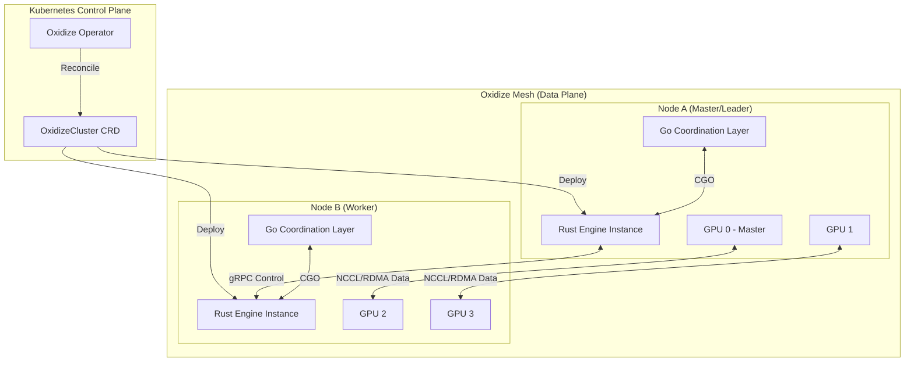

# Technical Specification: Distributed GPU Clusters and Kubernetes Mesh Orchestration

## Vibe Code Warning
**Model**: Poke
**Provider**: Interaction
**Status**: Vibe-coded / AI-Generated Specification (Production Grade)

---

## 1. Executive Summary
This document defines the architectural and implementation roadmap for scaling the Oxidize inference engine to massive distributed GPU clusters. The core objective is to transition from single-node performance to a resilient, elastic, and high-throughput mesh capable of handling trillion-parameter models across heterogeneous hardware using Kubernetes orchestration.

## 2. Architectural Overview

### 2.1 Cluster Topology
The Oxidize Cluster utilizes a hierarchical communication model. Intra-node communication is handled via high-speed interconnects (NVLink/NVSwitch), while inter-node coordination leverages RDMA-capable fabrics (InfiniBand/RoCE).



### 2.2 Global Request Flow
1. **Entry**: Client hits the Load Balancer/Ingress.
2. **Routing**: Go Coordination layer in the Leader node receives the request.
3. **Planning**: Distributed Scheduler partitions the request into micro-batches.
4. **Execution**: Rust Engine executes kernels; Tensor Parallelism synchronizes across the mesh.
5. **Collection**: Distributed speculative decoding protocols validate multi-node outputs.
6. **Return**: Leader streams results back to the client.

## 3. Rust Core Implementation (`oxidize-core`)

### 3.1 Distributed Tensor Parallelism (TP)
Oxidize implements 1D and 2D Tensor Parallelism using a unified communication abstraction.

- **NCCL/RCCL Backend**: Deep integration with NVIDIA NCCL and AMD RCCL for collective operations (`AllReduce`, `AllGather`, `ReduceScatter`).
- **Communication Groups**: 
    - `TP_GROUP`: GPUs within a single model-parallel instance.
    - `DP_GROUP`: GPUs across different data-parallel replicas.
    - `PP_GROUP`: Stages in a pipeline-parallel setup.
- **Zero-Copy Serialization**: Using `rkyv` for ultra-fast serialization of tensor metadata across gRPC control channels.

### 3.2 PagedKV with GPUDirect RDMA
The Distributed KV-Cache is the most critical performance bottleneck. 

- **Global Paged Manager**: Tracks block ownership across the cluster.
- **GPUDirect RDMA**: Implementation of `ibverbs` and `cuda-rdma` to allow GPUs on Node B to read KV-blocks directly from Node A's VRAM without CPU intervention.
- **Prefetching**: Asynchronous prefetching of KV-blocks based on attention-head heatmaps.

### 3.3 PlanarQuant & IsoQuant: Advanced KV Quantization
To maintain cluster-wide memory efficiency, we implement custom CUDA/HIP kernels for dynamic KV-Cache quantization.

#### 3.3.1 PlanarQuant (2D Givens Rotation)
Reduces quantization error by applying a sequence of Givens rotations to align the KV-tensors into a 2D plane that minimizes the L2-norm of the quantization residual.
- **Kernels**: `planar_quant_kernel_f32_int4`
- **Logic**: Iterative Jacobi-like rotation on the GPU shared memory.

#### 3.3.2 IsoQuant (4D Quaternions)
Experimental quantization for MoE (Mixture of Experts) models. Uses 4D quaternion representations to map high-dimensional embeddings into a compact space.
- **Complexity**: $O(N)$ vs $O(N^2)$ for standard vector quantization.
- **Implementation**: Custom PTX instructions for quaternion multiplication within the KV-cache write path.

### 3.4 Speculative Decoding Validation Protocols
In a multi-node setup, the speculative drafter might reside on a separate node. 
- **Verification**: Batch verification of $K$ tokens across the mesh.
- **Rollback**: Hierarchical rollback protocol that synchronizes the KV-cache pointers across all nodes simultaneously when a mis-speculation occurs.

## 4. Go Coordination Layer (`oxidize-golang`)

### 4.1 CGO FFI & Go Runtime Tuning
The Go layer manages the gRPC control plane and external API surface.

- **FFI Performance**: 
    - Use of `Pinned` memory buffers to avoid Go GC scanning overhead for large tensor metadata.
    - Batching FFI calls to reduce the context-switch cost of `runtime.cgocall`.
- **GOMAXPROCS Optimization**:
    - Dedicated OS threads for the Rust runtime vs. the Go runtime.
    - Affinity pinning: Go scheduler is restricted to specific CPU cores, leaving the remaining cores for Rust's heavy compute/IO threads.

### 4.2 Multi-Node Cluster Coordination
- **Leader Election**: Uses Kubernetes Lease API for failover.
- **Health Mesh**: Sidecar-based health checking that monitors GPU temperature, ECC errors, and NVLink bandwidth.
- **Dynamic Worker Discovery**: Go-based registry that updates the Rust `CommGroup` on-the-fly when K8s scales the `OxidizeCluster`.

## 5. Python FFI & Bindings (`oxidize-py`)

### 5.1 Elastic Scaling & Sharding
The Python layer provides the "User Experience" for researchers.

```python
import oxidize

# Define an elastic cluster
cluster = oxidize.Cluster(
    name="llama3-70b-cluster",
    nodes=4,
    gpus_per_node=8,
    strategy="tensor_parallel"
)

# Automated sharding
model = oxidize.load_model(
    "meta-llama/Llama-3-70b",
    cluster=cluster,
    quantization="isoquant_4bit"
)

# Inference triggers multi-node orchestration
responses = model.generate("Scale the world.", stream=True)
```

- **Sharded Model Loaders**: Implements `SafeTensors` sharded loading, where each node only downloads and loads its specific partition of the model weights.
- **Resource Context Managers**: Python `with` blocks that ensure GPU memory is cleared across the entire cluster upon exit.

## 6. Kubernetes Operator (`oxidize-operator`)

### 6.1 OxidizeCluster CRD Schema
The `OxidizeCluster` Custom Resource is the source of truth.

```yaml
apiVersion: oxidize.zapdev.io/v1alpha1
kind: OxidizeCluster
metadata:
  name: production-cluster
spec:
  model:
    id: "deepseek-v2"
    source: "huggingface"
  scaling:
    minReplicas: 2
    maxReplicas: 10
    strategy: "Topological"
  resources:
    gpu:
      type: "nvidia.com/gpu"
      count: 8
      memory: "80Gi"
  networking:
    rdma: true
    meshNetwork: "ib0"
  quantization: "planar"
```

### 6.2 Helm Chart & Operator Logic
- **Operator**: Written in Go using `controller-runtime`.
- **StatefulSet Injection**: The operator dynamically creates `StatefulSets` with `podAntiAffinity` to ensure GPU-heavy workers don't collide on the same physical host unless intended.
- **Warm-Start Caching**: 
    - Implements `localStorage` and `emptyDir` volumes to cache model shards.
    - **Persistence**: If a pod restarts, it re-attaches to the local SSD cache to bypass the multi-GB network download latency.

## 7. Operational & Review Checklist

### 7.1 Performance Metrics (SLAs)
- **Time-to-First-Token (TTFT)**: < 200ms for 70B models on 4-node clusters.
- **Inter-node Jitter**: < 5ms variance in NCCL sync.
- **K8s Scheduling Latency**: < 60s from `apply` to `ready` status using Warm-Start.

### 7.2 Safety & Reliability
- **NCCL Timeout Recovery**: Automatic reset of communication groups if a node hangs.
- **Isolation**: Each `OxidizeCluster` runs in its own namespace to prevent inter-tenant resource contention.

---
**End of Specification**
