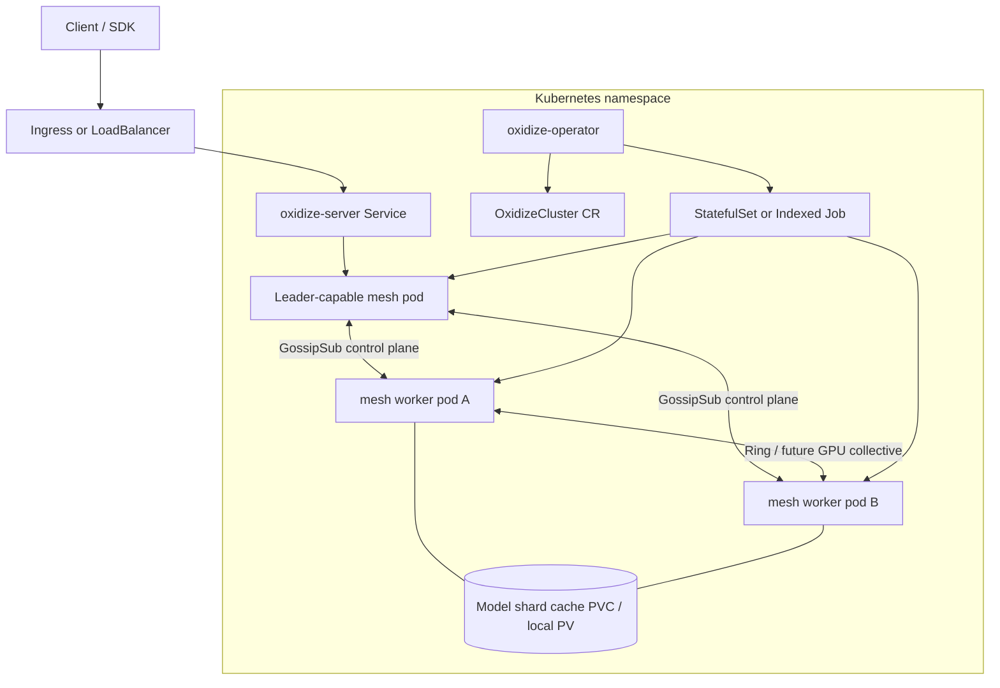

# Specification: GPU Kubernetes Mesh Orchestration

## 1. Purpose

This document defines the target design for running Oxidize as an elastic,
multi-node inference mesh on Kubernetes with GPU-aware placement. It is a
build specification, not a claim that all described GPU data-plane features
already exist.

The immediate goal is to connect the existing Oxidize mesh primitives to a
Kubernetes operator and define the missing work needed for production GPU
clusters:

- Kubernetes lifecycle management for mesh workers.
- GPU, memory, topology, and model-shard placement.
- OpenAI-compatible serving through the existing server surface.
- A path from today's CPU-oriented mesh collectives to GPU collectives such as
  NCCL, RCCL, Metal/MLX distributed backends, or RDMA-capable transports.

## 2. Current Oxidize State

### 2.1 Implemented Building Blocks

Oxidize already has a distributed mesh module in `oxidize-core/src/mesh/` with
the following reusable pieces:

| Area | Current primitive | Source |
| --- | --- | --- |
| Peer discovery | libp2p swarm, TCP, Noise, Yamux, mDNS discovery, namespace isolation | `discovery.rs`, `node.rs` |
| Control plane | Six namespaced GossipSub topics and `MeshEnvelope` session clocks | `gossip.rs` |
| Leader election | Deterministic bully-style election with election-clock invalidation | `election.rs` |
| Topology | Peer capability graph, stale-node eviction, aggregate capabilities | `topology.rs` |
| Sharding | Pipeline and tensor `ShardPlan` assignment over eligible workers | `sharding.rs` |
| Data movement | Ring transport abstraction with mock and TCP transports | `ring.rs` |
| Fault handling | Collective timeout helpers, runner status, shutdown task messages | `fault_tolerance.rs` |
| Validation | Mesh command, prompt, node, and shard-plan scrutiny | `scrutiny.rs` |

The mesh API is intentionally centralized through `oxidize-core/src/mesh/mod.rs`.
Any Kubernetes integration should treat that module as the public boundary.

### 2.2 Important Gaps

The following are not complete production capabilities today and must be
planned as implementation work:

- GPU backends are still maturing; existing perf documents describe CUDA,
  Metal, Vulkan, and WebGPU support as incomplete compared with llama.cpp,
  vLLM, and TensorRT-LLM.
- Current mesh collectives use the `RingTransport` abstraction; there is no
  production NCCL/RCCL data-plane backend wired through the mesh.
- PagedAttention scheduling exists as a subsystem, but production-grade
  distributed paged KV ownership, prefix sharing, and remote KV migration are
  future work.
- The Go and Python ports exist, but this spec keeps Kubernetes orchestration
  out of those ports until the Rust mesh contract is stable.
- Multi-tenant admission control, GPU quota enforcement, and model-cache
  eviction need operator-level implementation.

## 3. Design Goals

1. Run one logical `OxidizeCluster` as a namespace-scoped Kubernetes resource.
2. Keep the Rust mesh as the source of truth for peer membership, election,
   sharding, and inference data-plane contracts.
3. Keep Kubernetes responsible for desired state, placement, rolling updates,
   identity, storage, and service exposure.
4. Prefer capability-driven scheduling over static replica counts. GPU type,
   VRAM, topology, fabric, model size, quantization, and available cache all
   affect placement.
5. Support CPU-only and mixed CPU/GPU clusters as degraded but valid
   configurations.
6. Make failures explicit: a failed shard, hung collective, evicted node, or
   stale election must move cluster status into a visible condition.

## 4. Non-Goals

- Do not replace the existing Rust workspace or move mesh control into Go.
- Do not require Kubernetes for local peer-to-peer development.
- Do not promise RDMA, NCCL/RCCL, GPUDirect, or custom GPU kernels until the
  backend contracts are implemented and benchmarked.
- Do not expose cluster-internal GossipSub topics directly to public clients.
- Do not make the Python package the control-plane owner for Kubernetes.

## 5. Target Architecture



### 5.1 Control Plane

The control plane is the existing mesh:

- Each pod starts one Oxidize mesh node with a shared namespace derived from
  the `OxidizeCluster` name and UID.
- GossipSub topics remain namespaced as `oxidize/mesh/{namespace}/{topic}`.
- Election-clock invalidation remains the mechanism for ignoring stale
  messages after leader changes.
- Kubernetes readiness reflects mesh readiness: a pod is Ready only when it has
  joined the mesh, advertised capabilities, and accepted the latest election
  clock.

### 5.2 Kubernetes Reconciliation Plane

The operator reconciles desired infrastructure state:

- Creates service accounts, RBAC, Services, StatefulSets, PVC templates, and
  optional NetworkPolicies.
- Injects model, mesh, cache, and resource settings as env vars and config
  files.
- Watches pods and converts Kubernetes-level failures into
  `OxidizeCluster.status.conditions`.
- Performs safe rolling updates by adding replacement pods, waiting for mesh
  convergence, then draining old pods.

### 5.3 Data Plane

The first production milestone should use the existing ring/TCP data plane for
correctness. GPU data-plane support is staged behind explicit backend
capability flags:

| Stage | Transport | Purpose | Exit criteria |
| --- | --- | --- | --- |
| V0 | TCP ring | Correct sharding, election, and recovery in Kubernetes | Multi-pod CPU fixture passes |
| V1 | Host-local GPU backend | One pod can use CUDA, Metal, Vulkan, MLX, or WebGPU backend where available | Single-node GPU benchmark beats CPU |
| V2 | Node-local multi-GPU | Multiple GPUs in one pod or one node participate in tensor parallelism | Correct all-reduce/all-gather benchmark |
| V3 | Multi-node GPU collectives | NCCL/RCCL, vendor library, or RDMA-capable transport behind `RingTransport` successor | Fault-injected cluster benchmark |
| V4 | Distributed paged KV | Remote KV block ownership, prefetch, migration, and prefix-cache accounting | Continuous batching regression suite |

## 6. Kubernetes API

### 6.1 Custom Resource

```yaml
apiVersion: oxidize.dev/v1alpha1
kind: OxidizeCluster
metadata:
  name: llama-70b
  namespace: inference
spec:
  model:
    id: meta-llama/Llama-3.1-70B-Instruct
    format: gguf
    source:
      kind: huggingface
      revision: main
    quantization: Q4_K_M
  serving:
    replicas:
      min: 2
      max: 8
    openAICompatible: true
    realtimeWebSocket: true
  mesh:
    namespace: llama-70b
    strategy: Pipeline
    listenPort: 0
    collectiveTimeoutSeconds: 60
  placement:
    gpu:
      required: true
      resourceName: nvidia.com/gpu
      countPerPod: 1
      minMemoryGiB: 40
    topology:
      preferSameRack: true
      requireRdma: false
    cache:
      storageClassName: local-ssd
      size: 512Gi
  rollout:
    maxUnavailable: 0
    maxSurge: 1
    drainTimeoutSeconds: 120
```

### 6.2 Status

```yaml
status:
  phase: Ready
  observedGeneration: 7
  leaderPeerId: "12D3KooW..."
  mesh:
    electionClock: 42
    peersReady: 4
    peersDesired: 4
    strategy: Pipeline
  capacity:
    totalMemoryBytes: 343597383680
    totalCpuThreads: 128
    deviceTypes: ["cuda"]
    canShardNodes: 4
  model:
    loadedRevision: main
    shardPlanHash: "sha256:..."
  conditions:
    - type: Ready
      status: "True"
      reason: MeshConverged
      message: All mesh workers accepted the current shard plan.
```

### 6.3 Conditions

| Condition | Meaning |
| --- | --- |
| `Ready` | API traffic can be served. |
| `MeshConverged` | All desired peers accepted the current election clock and shard plan. |
| `ModelLoaded` | Required model shards are present and loaded on every assigned pod. |
| `Degraded` | Serving continues with reduced capacity or CPU fallback. |
| `CollectiveStalled` | A collective operation exceeded `collectiveTimeoutSeconds`. |
| `ShardPlanRejected` | Mesh validation rejected the computed plan. |
| `RolloutBlocked` | Replacement pods did not become mesh-ready before timeout. |

## 7. Pod Contract

Each worker pod must receive a small, explicit runtime contract:

| Env var | Source | Purpose |
| --- | --- | --- |
| `OXIDIZE_MESH_NAMESPACE` | Operator | Isolates GossipSub topics per cluster. |
| `OXIDIZE_MESH_MEMORY_BYTES` | Operator or node probe | Seeds advertised capability memory. |
| `OXIDIZE_MODEL_ID` | CRD | Model identity used by shard plans. |
| `OXIDIZE_MODEL_CACHE_DIR` | Volume mount | Local shard cache path. |
| `OXIDIZE_CLUSTER_UID` | Downward API | Stable namespace salt and status correlation. |
| `RUST_LOG` | Config | Verbose development logging when requested. |

Workers should advertise `NodeCapabilities` using the existing fields plus
well-known tags:

| Tag | Example | Meaning |
| --- | --- | --- |
| `gpu.vendor` | `nvidia` | Scheduler-visible GPU family. |
| `gpu.model` | `H100-SXM` | Device model. |
| `gpu.memory_bytes` | `85899345920` | Available VRAM estimate. |
| `fabric.rdma` | `true` | RDMA-capable fabric detected. |
| `fabric.nvlink` | `true` | Host-local NVLink available. |
| `backend.cuda` | `true` | CUDA backend usable by this binary. |
| `backend.mlx` | `true` | MLX backend usable by this binary. |

The existing `NodeCapabilities.tags` map is sufficient for these additions
without changing the public struct.

## 8. Scheduling and Sharding

### 8.1 Placement Inputs

The operator computes candidate pods and placement constraints from:

- CRD model size, format, quantization, and desired serving limits.
- Node labels from the Kubernetes device plugin and Node Feature Discovery.
- Existing mesh capability advertisements.
- Cache locality: prefer nodes with the required model shard already present.
- Failure domain labels such as zone, rack, and hostname.

### 8.2 Shard-Plan Flow

1. Operator creates or scales pods.
2. Pods join the mesh and advertise capabilities.
3. Current leader computes or receives a `ShardPlan`.
4. Current `validate_shard_plan` coverage rejects empty plans; capability-aware
   validation for memory, device type, and strategy constraints is required
   before Kubernetes production rollout.
5. Leader broadcasts the accepted plan on the namespaced `COMMANDS` topic.
6. Workers load assigned shards and report progress.
7. Cluster status moves to `Ready` only after all assigned workers report
   loaded state for the current election clock.

### 8.3 Strategy Selection

| Strategy | Use when | Current fit |
| --- | --- | --- |
| `Pipeline` | Model layers exceed one worker's memory; network bandwidth is moderate | Already represented by `ParallelismStrategy::Pipeline` |
| `Tensor` | Workers have high-bandwidth collectives and divisible tensor dimensions | Represented by `ParallelismStrategy::Tensor`; needs stronger GPU collectives |
| Data parallel replicas | Traffic volume requires multiple independent copies | Operator-level replica grouping; not a mesh primitive yet |
| Hybrid | Large models plus high QPS | Future: nested pipeline/tensor/data-parallel groups |

## 9. Serving Path

The public endpoint should remain the OpenAI-compatible Oxidize server:

1. Client sends HTTP or WebSocket request to the Service.
2. Request lands on any ready server pod.
3. Non-leader pods either forward to the elected leader or return a retryable
   redirect once a forwarding path is implemented.
4. Leader turns the request into a mesh command and streams tokens back through
   the existing server response path.
5. Cancellation propagates as a mesh command so workers can stop assigned
   shard work and release KV/cache reservations.

The first Kubernetes version may pin the Service to leader-capable pods only.
Later versions should support any-pod ingress after request forwarding is
implemented.

## 10. Storage and Model Cache

Use local storage aggressively because model downloads dominate startup time:

- Prefer local PVs or a storage class backed by node-local SSDs.
- Store complete model files or deterministic shard files under
  `OXIDIZE_MODEL_CACHE_DIR`.
- Key cache entries by model ID, revision, file digest, quantization, and shard
  assignment.
- Treat cache hits as hints only; the loader must verify file digest before use.
- Keep eviction controlled by the operator, not individual pods, so rolling
  updates do not evict hot shards unexpectedly.

## 11. Failure Handling

| Failure | Detection | Required behavior |
| --- | --- | --- |
| Pod crash | Kubernetes watch, libp2p disconnect, stale topology heartbeat | Remove peer, trigger election if needed, compute replacement plan. |
| Hung collective | `eval_with_timeout` / collective timeout | Mark `CollectiveStalled`, stop affected runners, rebuild comm group. |
| Leader loss | Election timeout and Kubernetes pod event | Elect new leader, increment election clock, reject stale messages. |
| Bad shard plan | `validate_shard_plan` | Reject plan, keep old serving plan if still valid. |
| Model load failure | Worker progress or exit status | Mark `ModelLoaded=False`, avoid routing traffic to new revision. |
| GPU health issue | Device plugin, DCGM, kubelet event, or worker tag update | Mark degraded, reschedule if policy allows. |
| Split brain | Divergent election clocks or duplicate leaders | Prefer highest accepted election clock and cluster UID namespace. |

## 12. Security

- Run each `OxidizeCluster` in its own namespace by default.
- Use one ServiceAccount per cluster with least-privilege RBAC for pods,
  configmaps, leases, PVCs, and status updates.
- Use NetworkPolicy to restrict mesh traffic to pods with the same cluster UID.
- Do not expose libp2p listen ports through public Services.
- Require image digests for production deployments.
- Mount HuggingFace or object-store credentials as Secrets; never put them in
  the CRD status.
- Treat model files as supply-chain artifacts: verify digest before loading.
- Keep public HTTP auth at the server/API gateway layer, not in GossipSub.

## 13. Observability

The operator and workers should expose:

| Metric | Owner |
| --- | --- |
| `oxidize_mesh_peers_ready` | Operator |
| `oxidize_mesh_election_clock` | Worker |
| `oxidize_mesh_shard_plan_generation` | Leader |
| `oxidize_model_load_seconds` | Worker |
| `oxidize_model_cache_hit_total` | Worker |
| `oxidize_collective_timeout_total` | Worker |
| `oxidize_tokens_generated_total` | Server |
| `oxidize_time_to_first_token_seconds` | Server |
| `oxidize_gpu_memory_bytes` | Worker or device exporter |

Logs should include `cluster`, `pod`, `peer_id`, `election_clock`,
`model_id`, `shard_plan_hash`, and `request_id` where applicable.

## 14. Rollout Plan

### Phase 0: Spec and Test Harness

- Add this specification.
- Add documentation checks that prevent future drift into unsupported
  implementation claims.
- Define a small fake cluster fixture for operator design work.

### Phase 1: Kubernetes Manifests Without Operator

- Provide a sample StatefulSet, headless Service, and ConfigMap.
- Run two or more CPU mesh pods in a local Kubernetes cluster.
- Verify discovery, election, shard-plan broadcast, and graceful shutdown.

### Phase 2: Minimal Operator

- Implement `OxidizeCluster` CRD and reconciler.
- Create StatefulSet, Service, RBAC, PVC templates, and status conditions.
- Surface mesh readiness through CRD status.

### Phase 3: GPU-Aware Scheduling

- Read GPU labels and device-plugin resources.
- Advertise GPU capability tags from workers.
- Prefer cache-local and topology-aware placements.
- Keep CPU fallback explicit through `Degraded` status.

### Phase 4: Production Data Plane

- Replace or extend the ring data plane with GPU-capable collectives.
- Add benchmark gates for all-gather, all-reduce/all-sum, and pipeline
  activation transfer.
- Add failure-injection tests for stalled collectives and node loss.

### Phase 5: Distributed Paged KV

- Define global KV block ownership and per-request reservations.
- Integrate with the paged scheduler and prefix-cache accounting.
- Add remote block migration or prefetch only after correctness tests pass.

## 15. Acceptance Criteria

The first production-ready operator milestone is complete only when:

1. A two-pod CPU cluster converges in Kubernetes and serves a basic request.
2. A pod crash triggers a new election or replacement without stale messages
   being accepted.
3. The CRD status exposes leader, peer count, shard-plan generation, model load
   state, and degraded conditions.
4. A rolling update with `maxUnavailable: 0` keeps the old serving plan until
   the new plan is loaded.
5. Model cache reuse survives a pod restart on the same node.
6. NetworkPolicy prevents cross-cluster mesh traffic.
7. Benchmarks exist before claiming GPU speedups.

## 16. Open Questions

- Should the first operator be written in Rust to share mesh types, or in Go to
  match the Kubernetes controller ecosystem?
- Should request ingress be leader-pinned initially, or should forwarding be
  implemented before the first operator release?
- What is the minimum supported local Kubernetes target: kind, k3d, k3s,
  minikube, or real GPU clusters only?
- Which GPU collective backend lands first: NCCL/RCCL, MLX distributed, Vulkan
  cooperative matrix path, or a transport-neutral ring upgrade?
- How should Go and pure-Python ports consume Kubernetes status without taking
  ownership of the control plane?

## 17. References

- `oxidize-core/src/mesh/AGENTS.md` for mesh ownership and conventions.
- `oxidize-core/src/mesh/mod.rs` for the public mesh API boundary.
- `docs/research_exo_mesh_protocol.md` for prior art in libp2p-based
  distributed inference mesh design.
- `docs/pagedattention_research_report.md` for paged KV and scheduler
  background.
- `docs/perf_analysis_report.md` and `docs/perf_research_report.md` for current
  GPU/backend maturity notes.
- `docs/roadmap.md` for current project priorities and performance caveats.
